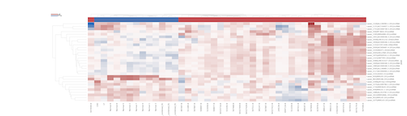
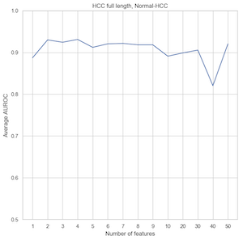
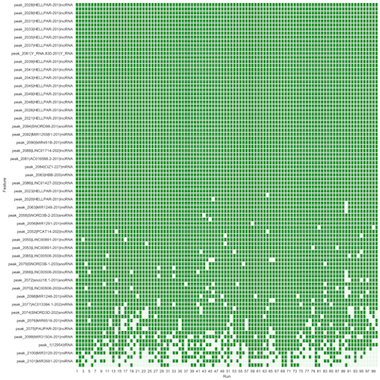
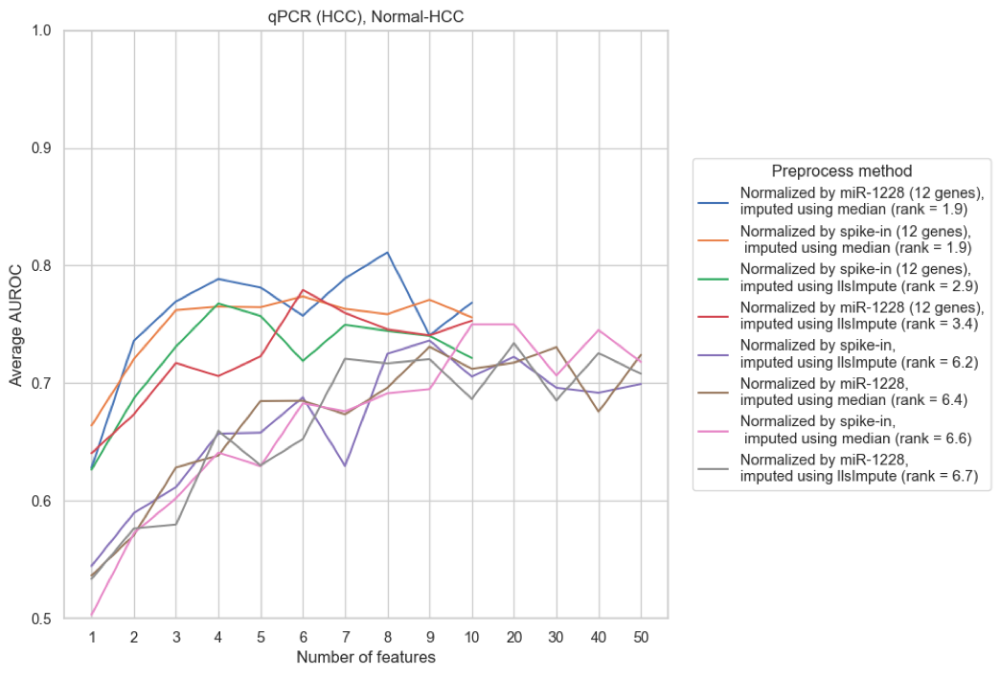

# Model evaluation and Feature Interpretation 

## Visualize Feature Selection Result

### Cluster map  

Use selected feature's count to plot heatmap and cluster both samples and features.

### Refit model and plot ROC cureve   

The ROC curve here has its special features. In robust feature selection pipeline, we divide the data set in two ways:

* **leave one out**, one sample is randomly selected as the validation set in each round, and the other samples are used as the training set to predict the validation set, and finally each sample is guaranteed to be the validation set once.
* **shuffle split**, some samples are randomly selected as the validation set in each round, and other samples are used as the training set to predict the validation set. Finally, each sample may be predicted several times in different rounds.

For leave one out, all the samples are predicted once.

 

For the shuffle split method, each sample is predicted multiple times, and the ROC curve cannot be drawn together. Each round can have a single ROC curve. The following picture shows "the combination of the curves". We use the shaded area to represent the confidence interval for the mean of each point.

## Use AUC line plot to evaluate feature nums 

For different number of features, AUC is used to evaluate their classification effect.

## Compare different models and parameters

The colored patches in the figure indicate the features selected under the specific parameters. In this case, the features selected by the linear model are more similar, and the feature selected by the random forest under different parameter settings is more stable.

## Feature robustness

Each column indicate a round of tests. In this case (random forest model), it can be found that most features are picked in every round of testing, which indicates that these features are very robust. We can set a threshold and choose features appear in more than 50% of the rounds as the final choice 

## Evaluate different models

Venn plot can be used to visualize feature overlap between different models.

- [ ] to do: update figures

## Subsequent validation
### qPCR
feed in selected genes qPCR result

- ROC plot

- Model selection

- [ ] To do: more details 

