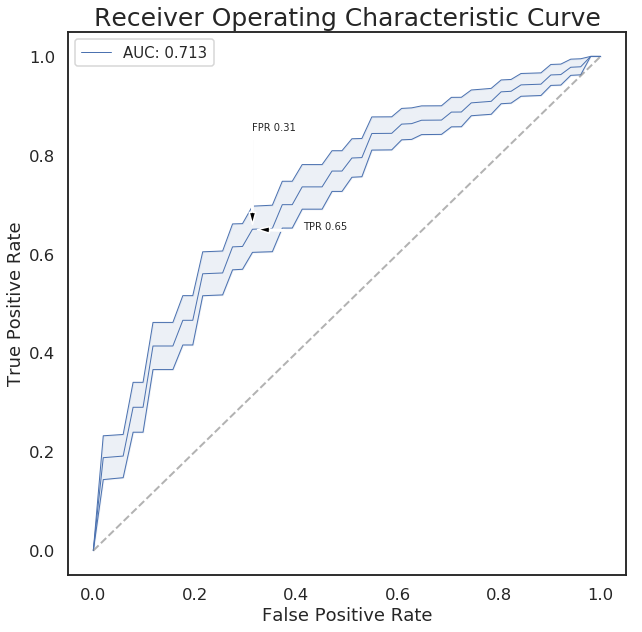

# Robust Feature Selection 


## Command line usage
```
usage: feature_selection.py evaluate [-h] --matrix MATRIX --sample-classes
                                     SAMPLE_CLASSES [--transpose]
                                     [--positive-class POSITIVE_CLASS]
                                     [--negative-class NEGATIVE_CLASS]
                                     [--use-log]
                                     [--scaler {zscore,robust,max_abs,min_max,none}]
                                     [--method {logistic_regression,random_forest,linear_svm}]
                                     --output-dir OUTPUT_DIR
                                     [--compute-sample-weight]
                                     [--splitter {kfold,stratified_kfold,shuffle_split,repeated_stratified_kfold,leave_one_out,stratified_shuffle_split}]
                                     [--rfe] [--rfe-step RFE_STEP]
                                     [--n-select N_SELECT]
                                     [--n-splits N_SPLITS]
                                     [--n-repeats N_REPEATS]
                                     [--test-size TEST_SIZE] [--scorer SCORER]
                                     [--robust-select]
                                     [--robust-resample-method {bootstrap,jackknife}]
                                     [--robust-max-runs ROBUST_MAX_RUNS]
                                     [--robust-jackknife-remove ROBUST_JACKKNIFE_REMOVE]
                                     [--top-features-by-median TOP_FEATURES_BY_MEDIAN]
                                     [--remove-zero-features REMOVE_ZERO_FEATURES]

optional arguments:
  -h, --help            show this help message and exit
  --matrix MATRIX, -i MATRIX
                        input feature matrix (rows are samples and columns are
                        features
  --sample-classes SAMPLE_CLASSES
                        input file containing sample classes with 2 columns:
                        sample_id, sample_class
  --transpose           transpose the feature matrix
  --positive-class POSITIVE_CLASS
                        comma-separated list of sample classes to use as
                        positive class
  --negative-class NEGATIVE_CLASS
                        comma-separates list of sample classes to use as
                        negative class
  --use-log             apply log2 to feature matrix
  --scaler {zscore,robust,max_abs,min_max,none}
                        method for scaling features
  --method {logistic_regression,random_forest,linear_svm}
                        feature selection method
  --output-dir OUTPUT_DIR, -o OUTPUT_DIR
                        output directory
  --compute-sample-weight
                        compute sample weight to balance classes
  --splitter {kfold,stratified_kfold,shuffle_split,repeated_stratified_kfold,leave_one_out,stratified_shuffle_split}
  --rfe                 use RFE to select features
  --rfe-step RFE_STEP   number/fraction of features to eliminate in each step
  --n-select N_SELECT   number of features to select
  --n-splits N_SPLITS   number of splits for kfold, stratified_kfold and
                        shuffle_splits
  --n-repeats N_REPEATS
                        number of repeats for repeated_stratified_kfold and
                        repeated_kfold
  --test-size TEST_SIZE
                        fraction/number of samples for testing
  --scorer SCORER       metric to use
  --robust-select       use robust feature selection by selecting recurring
                        features across resampling runs
  --robust-resample-method {bootstrap,jackknife}
                        resampling method for robust feature selection
  --robust-max-runs ROBUST_MAX_RUNS
                        number of resampling runs for robust feature
                        selections
  --robust-jackknife-remove ROBUST_JACKKNIFE_REMOVE
                        number/fraction of samples to remove during each
                        resampling run for robust feature selection
  --top-features-by-median TOP_FEATURES_BY_MEDIAN
                        select this number of features with highest median
                        values across samples
  --remove-zero-features REMOVE_ZERO_FEATURES
                        remove features that have fraction of zero values
                        above this value
```


## Robust Feature Selection Pipeline

- Normalize domain coverage by total coverage of all domains (CPM), Normalize Top20 and others separately. 
- Scale each feature (log CPM) independently (using z-scores, min-max, robust normalization)
- Run a classifier (random forest, logistic regression, linear SVM) to select features based on feature importance. Optimize hyper-parameters by 3-fold cross-validation.
- **Optionally**, use a recursive feature elimination(RFE).
- Do resampling runs to select robust features:
    - shuffle and split dataset and repeat feature selection for 100 times(shuffle split)
    - Or randomly test 1 sample in each run (leave one out).
- Select features that are recurrently selected across resampling runs (>50%)
- Refit the classifier on selected features


### AUC line plot


### Selected feature weight

<style  type="text/css" >
    #T_ad740884_f9d6_11e8_8419_e53235559c93row0_col0 {
            background-color:  #008000;
        }    #T_ad740884_f9d6_11e8_8419_e53235559c93row0_col1 {
            background-color:  #e5ffe5;
        }    #T_ad740884_f9d6_11e8_8419_e53235559c93row0_col2 {
            background-color:  #008000;
        }    #T_ad740884_f9d6_11e8_8419_e53235559c93row0_col3 {
            background-color:  #339c33;
        }    #T_ad740884_f9d6_11e8_8419_e53235559c93row0_col4 {
            background-color:  #349d34;
        }    #T_ad740884_f9d6_11e8_8419_e53235559c93row0_col5 {
            background-color:  #e5ffe5;
        }    #T_ad740884_f9d6_11e8_8419_e53235559c93row0_col6 {
            background-color:  #e5ffe5;
        }    #T_ad740884_f9d6_11e8_8419_e53235559c93row0_col7 {
            background-color:  #e5ffe5;
        }    #T_ad740884_f9d6_11e8_8419_e53235559c93row0_col8 {
            background-color:  #e5ffe5;
        }    #T_ad740884_f9d6_11e8_8419_e53235559c93row0_col9 {
            background-color:  #e5ffe5;
        }    #T_ad740884_f9d6_11e8_8419_e53235559c93row1_col0 {
            background-color:  #e5ffe5;
        }    #T_ad740884_f9d6_11e8_8419_e53235559c93row1_col1 {
            background-color:  #e5ffe5;
        }    #T_ad740884_f9d6_11e8_8419_e53235559c93row1_col2 {
            background-color:  #e5ffe5;
        }    #T_ad740884_f9d6_11e8_8419_e53235559c93row1_col3 {
            background-color:  #e5ffe5;
        }    #T_ad740884_f9d6_11e8_8419_e53235559c93row1_col4 {
            background-color:  #e5ffe5;
        }    #T_ad740884_f9d6_11e8_8419_e53235559c93row1_col5 {
            background-color:  #e5ffe5;
        }    #T_ad740884_f9d6_11e8_8419_e53235559c93row1_col6 {
            background-color:  #e5ffe5;
        }    #T_ad740884_f9d6_11e8_8419_e53235559c93row1_col7 {
            background-color:  #e5ffe5;
        }    #T_ad740884_f9d6_11e8_8419_e53235559c93row1_col8 {
            background-color:  #8acc8a;
        }    #T_ad740884_f9d6_11e8_8419_e53235559c93row1_col9 {
            background-color:  #e5ffe5;
        }    #T_ad740884_f9d6_11e8_8419_e53235559c93row2_col0 {
            background-color:  #e5ffe5;
        }    #T_ad740884_f9d6_11e8_8419_e53235559c93row2_col1 {
            background-color:  #e5ffe5;
        }    #T_ad740884_f9d6_11e8_8419_e53235559c93row2_col2 {
            background-color:  #e5ffe5;
        }    #T_ad740884_f9d6_11e8_8419_e53235559c93row2_col3 {
            background-color:  #e5ffe5;
        }    #T_ad740884_f9d6_11e8_8419_e53235559c93row2_col4 {
            background-color:  #008000;
        }    #T_ad740884_f9d6_11e8_8419_e53235559c93row2_col5 {
            background-color:  #e5ffe5;
        }    #T_ad740884_f9d6_11e8_8419_e53235559c93row2_col6 {
            background-color:  #e5ffe5;
        }    #T_ad740884_f9d6_11e8_8419_e53235559c93row2_col7 {
            background-color:  #e5ffe5;
        }    #T_ad740884_f9d6_11e8_8419_e53235559c93row2_col8 {
            background-color:  #e5ffe5;
        }    #T_ad740884_f9d6_11e8_8419_e53235559c93row2_col9 {
            background-color:  #e5ffe5;
        }    #T_ad740884_f9d6_11e8_8419_e53235559c93row3_col0 {
            background-color:  #e5ffe5;
        }    #T_ad740884_f9d6_11e8_8419_e53235559c93row3_col1 {
            background-color:  #e5ffe5;
        }    #T_ad740884_f9d6_11e8_8419_e53235559c93row3_col2 {
            background-color:  #e5ffe5;
        }    #T_ad740884_f9d6_11e8_8419_e53235559c93row3_col3 {
            background-color:  #e5ffe5;
        }    #T_ad740884_f9d6_11e8_8419_e53235559c93row3_col4 {
            background-color:  #e5ffe5;
        }    #T_ad740884_f9d6_11e8_8419_e53235559c93row3_col5 {
            background-color:  #e5ffe5;
        }    #T_ad740884_f9d6_11e8_8419_e53235559c93row3_col6 {
            background-color:  #e5ffe5;
        }    #T_ad740884_f9d6_11e8_8419_e53235559c93row3_col7 {
            background-color:  #65b865;
        }    #T_ad740884_f9d6_11e8_8419_e53235559c93row3_col8 {
            background-color:  #6fbd6f;
        }    #T_ad740884_f9d6_11e8_8419_e53235559c93row3_col9 {
            background-color:  #e5ffe5;
        }    #T_ad740884_f9d6_11e8_8419_e53235559c93row4_col0 {
            background-color:  #e5ffe5;
        }    #T_ad740884_f9d6_11e8_8419_e53235559c93row4_col1 {
            background-color:  #e5ffe5;
        }    #T_ad740884_f9d6_11e8_8419_e53235559c93row4_col2 {
            background-color:  #e5ffe5;
        }    #T_ad740884_f9d6_11e8_8419_e53235559c93row4_col3 {
            background-color:  #e5ffe5;
        }    #T_ad740884_f9d6_11e8_8419_e53235559c93row4_col4 {
            background-color:  #e5ffe5;
        }    #T_ad740884_f9d6_11e8_8419_e53235559c93row4_col5 {
            background-color:  #3da23d;
        }    #T_ad740884_f9d6_11e8_8419_e53235559c93row4_col6 {
            background-color:  #e5ffe5;
        }    #T_ad740884_f9d6_11e8_8419_e53235559c93row4_col7 {
            background-color:  #e5ffe5;
        }    #T_ad740884_f9d6_11e8_8419_e53235559c93row4_col8 {
            background-color:  #59b159;
        }    #T_ad740884_f9d6_11e8_8419_e53235559c93row4_col9 {
            background-color:  #47a747;
        }    #T_ad740884_f9d6_11e8_8419_e53235559c93row5_col0 {
            background-color:  #e5ffe5;
        }    #T_ad740884_f9d6_11e8_8419_e53235559c93row5_col1 {
            background-color:  #e5ffe5;
        }    #T_ad740884_f9d6_11e8_8419_e53235559c93row5_col2 {
            background-color:  #e5ffe5;
        }    #T_ad740884_f9d6_11e8_8419_e53235559c93row5_col3 {
            background-color:  #e5ffe5;
        }    #T_ad740884_f9d6_11e8_8419_e53235559c93row5_col4 {
            background-color:  #e5ffe5;
        }    #T_ad740884_f9d6_11e8_8419_e53235559c93row5_col5 {
            background-color:  #e5ffe5;
        }    #T_ad740884_f9d6_11e8_8419_e53235559c93row5_col6 {
            background-color:  #e5ffe5;
        }    #T_ad740884_f9d6_11e8_8419_e53235559c93row5_col7 {
            background-color:  #e5ffe5;
        }    #T_ad740884_f9d6_11e8_8419_e53235559c93row5_col8 {
            background-color:  #e5ffe5;
        }    #T_ad740884_f9d6_11e8_8419_e53235559c93row5_col9 {
            background-color:  #a2daa2;
        }    #T_ad740884_f9d6_11e8_8419_e53235559c93row6_col0 {
            background-color:  #e5ffe5;
        }    #T_ad740884_f9d6_11e8_8419_e53235559c93row6_col1 {
            background-color:  #e5ffe5;
        }    #T_ad740884_f9d6_11e8_8419_e53235559c93row6_col2 {
            background-color:  #e5ffe5;
        }    #T_ad740884_f9d6_11e8_8419_e53235559c93row6_col3 {
            background-color:  #e5ffe5;
        }    #T_ad740884_f9d6_11e8_8419_e53235559c93row6_col4 {
            background-color:  #51ad51;
        }    #T_ad740884_f9d6_11e8_8419_e53235559c93row6_col5 {
            background-color:  #e5ffe5;
        }    #T_ad740884_f9d6_11e8_8419_e53235559c93row6_col6 {
            background-color:  #e5ffe5;
        }    #T_ad740884_f9d6_11e8_8419_e53235559c93row6_col7 {
            background-color:  #e5ffe5;
        }    #T_ad740884_f9d6_11e8_8419_e53235559c93row6_col8 {
            background-color:  #e5ffe5;
        }    #T_ad740884_f9d6_11e8_8419_e53235559c93row6_col9 {
            background-color:  #e5ffe5;
        }    #T_ad740884_f9d6_11e8_8419_e53235559c93row7_col0 {
            background-color:  #e5ffe5;
        }    #T_ad740884_f9d6_11e8_8419_e53235559c93row7_col1 {
            background-color:  #e5ffe5;
        }    #T_ad740884_f9d6_11e8_8419_e53235559c93row7_col2 {
            background-color:  #e5ffe5;
        }    #T_ad740884_f9d6_11e8_8419_e53235559c93row7_col3 {
            background-color:  #e5ffe5;
        }    #T_ad740884_f9d6_11e8_8419_e53235559c93row7_col4 {
            background-color:  #309a30;
        }    #T_ad740884_f9d6_11e8_8419_e53235559c93row7_col5 {
            background-color:  #e5ffe5;
        }    #T_ad740884_f9d6_11e8_8419_e53235559c93row7_col6 {
            background-color:  #6cbc6c;
        }    #T_ad740884_f9d6_11e8_8419_e53235559c93row7_col7 {
            background-color:  #e5ffe5;
        }    #T_ad740884_f9d6_11e8_8419_e53235559c93row7_col8 {
            background-color:  #e5ffe5;
        }    #T_ad740884_f9d6_11e8_8419_e53235559c93row7_col9 {
            background-color:  #e5ffe5;
        }    #T_ad740884_f9d6_11e8_8419_e53235559c93row8_col0 {
            background-color:  #e5ffe5;
        }    #T_ad740884_f9d6_11e8_8419_e53235559c93row8_col1 {
            background-color:  #e5ffe5;
        }    #T_ad740884_f9d6_11e8_8419_e53235559c93row8_col2 {
            background-color:  #e5ffe5;
        }    #T_ad740884_f9d6_11e8_8419_e53235559c93row8_col3 {
            background-color:  #e5ffe5;
        }    #T_ad740884_f9d6_11e8_8419_e53235559c93row8_col4 {
            background-color:  #e5ffe5;
        }    #T_ad740884_f9d6_11e8_8419_e53235559c93row8_col5 {
            background-color:  #e5ffe5;
        }    #T_ad740884_f9d6_11e8_8419_e53235559c93row8_col6 {
            background-color:  #e5ffe5;
        }    #T_ad740884_f9d6_11e8_8419_e53235559c93row8_col7 {
            background-color:  #e5ffe5;
        }    #T_ad740884_f9d6_11e8_8419_e53235559c93row8_col8 {
            background-color:  #7fc67f;
        }    #T_ad740884_f9d6_11e8_8419_e53235559c93row8_col9 {
            background-color:  #e5ffe5;
        }    #T_ad740884_f9d6_11e8_8419_e53235559c93row9_col0 {
            background-color:  #e5ffe5;
        }    #T_ad740884_f9d6_11e8_8419_e53235559c93row9_col1 {
            background-color:  #e5ffe5;
        }    #T_ad740884_f9d6_11e8_8419_e53235559c93row9_col2 {
            background-color:  #e5ffe5;
        }    #T_ad740884_f9d6_11e8_8419_e53235559c93row9_col3 {
            background-color:  #e5ffe5;
        }    #T_ad740884_f9d6_11e8_8419_e53235559c93row9_col4 {
            background-color:  #e5ffe5;
        }    #T_ad740884_f9d6_11e8_8419_e53235559c93row9_col5 {
            background-color:  #e5ffe5;
        }    #T_ad740884_f9d6_11e8_8419_e53235559c93row9_col6 {
            background-color:  #e5ffe5;
        }    #T_ad740884_f9d6_11e8_8419_e53235559c93row9_col7 {
            background-color:  #77c277;
        }    #T_ad740884_f9d6_11e8_8419_e53235559c93row9_col8 {
            background-color:  #e5ffe5;
        }    #T_ad740884_f9d6_11e8_8419_e53235559c93row9_col9 {
            background-color:  #e5ffe5;
        }    #T_ad740884_f9d6_11e8_8419_e53235559c93row10_col0 {
            background-color:  #e5ffe5;
        }    #T_ad740884_f9d6_11e8_8419_e53235559c93row10_col1 {
            background-color:  #e5ffe5;
        }    #T_ad740884_f9d6_11e8_8419_e53235559c93row10_col2 {
            background-color:  #e5ffe5;
        }    #T_ad740884_f9d6_11e8_8419_e53235559c93row10_col3 {
            background-color:  #e5ffe5;
        }    #T_ad740884_f9d6_11e8_8419_e53235559c93row10_col4 {
            background-color:  #e5ffe5;
        }    #T_ad740884_f9d6_11e8_8419_e53235559c93row10_col5 {
            background-color:  #e5ffe5;
        }    #T_ad740884_f9d6_11e8_8419_e53235559c93row10_col6 {
            background-color:  #e5ffe5;
        }    #T_ad740884_f9d6_11e8_8419_e53235559c93row10_col7 {
            background-color:  #6fbd6f;
        }    #T_ad740884_f9d6_11e8_8419_e53235559c93row10_col8 {
            background-color:  #e5ffe5;
        }    #T_ad740884_f9d6_11e8_8419_e53235559c93row10_col9 {
            background-color:  #caf0ca;
        }    #T_ad740884_f9d6_11e8_8419_e53235559c93row11_col0 {
            background-color:  #e5ffe5;
        }    #T_ad740884_f9d6_11e8_8419_e53235559c93row11_col1 {
            background-color:  #e5ffe5;
        }    #T_ad740884_f9d6_11e8_8419_e53235559c93row11_col2 {
            background-color:  #e5ffe5;
        }    #T_ad740884_f9d6_11e8_8419_e53235559c93row11_col3 {
            background-color:  #1a8e1a;
        }    #T_ad740884_f9d6_11e8_8419_e53235559c93row11_col4 {
            background-color:  #e5ffe5;
        }    #T_ad740884_f9d6_11e8_8419_e53235559c93row11_col5 {
            background-color:  #e5ffe5;
        }    #T_ad740884_f9d6_11e8_8419_e53235559c93row11_col6 {
            background-color:  #e5ffe5;
        }    #T_ad740884_f9d6_11e8_8419_e53235559c93row11_col7 {
            background-color:  #e5ffe5;
        }    #T_ad740884_f9d6_11e8_8419_e53235559c93row11_col8 {
            background-color:  #e5ffe5;
        }    #T_ad740884_f9d6_11e8_8419_e53235559c93row11_col9 {
            background-color:  #e5ffe5;
        }    #T_ad740884_f9d6_11e8_8419_e53235559c93row12_col0 {
            background-color:  #e5ffe5;
        }    #T_ad740884_f9d6_11e8_8419_e53235559c93row12_col1 {
            background-color:  #e5ffe5;
        }    #T_ad740884_f9d6_11e8_8419_e53235559c93row12_col2 {
            background-color:  #e5ffe5;
        }    #T_ad740884_f9d6_11e8_8419_e53235559c93row12_col3 {
            background-color:  #e5ffe5;
        }    #T_ad740884_f9d6_11e8_8419_e53235559c93row12_col4 {
            background-color:  #e5ffe5;
        }    #T_ad740884_f9d6_11e8_8419_e53235559c93row12_col5 {
            background-color:  #b5e4b5;
        }    #T_ad740884_f9d6_11e8_8419_e53235559c93row12_col6 {
            background-color:  #e5ffe5;
        }    #T_ad740884_f9d6_11e8_8419_e53235559c93row12_col7 {
            background-color:  #e5ffe5;
        }    #T_ad740884_f9d6_11e8_8419_e53235559c93row12_col8 {
            background-color:  #e5ffe5;
        }    #T_ad740884_f9d6_11e8_8419_e53235559c93row12_col9 {
            background-color:  #e5ffe5;
        }    #T_ad740884_f9d6_11e8_8419_e53235559c93row13_col0 {
            background-color:  #e5ffe5;
        }    #T_ad740884_f9d6_11e8_8419_e53235559c93row13_col1 {
            background-color:  #e5ffe5;
        }    #T_ad740884_f9d6_11e8_8419_e53235559c93row13_col2 {
            background-color:  #e5ffe5;
        }    #T_ad740884_f9d6_11e8_8419_e53235559c93row13_col3 {
            background-color:  #e5ffe5;
        }    #T_ad740884_f9d6_11e8_8419_e53235559c93row13_col4 {
            background-color:  #e5ffe5;
        }    #T_ad740884_f9d6_11e8_8419_e53235559c93row13_col5 {
            background-color:  #e5ffe5;
        }    #T_ad740884_f9d6_11e8_8419_e53235559c93row13_col6 {
            background-color:  #a4dba4;
        }    #T_ad740884_f9d6_11e8_8419_e53235559c93row13_col7 {
            background-color:  #e5ffe5;
        }    #T_ad740884_f9d6_11e8_8419_e53235559c93row13_col8 {
            background-color:  #e5ffe5;
        }    #T_ad740884_f9d6_11e8_8419_e53235559c93row13_col9 {
            background-color:  #67b967;
        }    #T_ad740884_f9d6_11e8_8419_e53235559c93row14_col0 {
            background-color:  #e5ffe5;
        }    #T_ad740884_f9d6_11e8_8419_e53235559c93row14_col1 {
            background-color:  #e5ffe5;
        }    #T_ad740884_f9d6_11e8_8419_e53235559c93row14_col2 {
            background-color:  #e5ffe5;
        }    #T_ad740884_f9d6_11e8_8419_e53235559c93row14_col3 {
            background-color:  #e5ffe5;
        }    #T_ad740884_f9d6_11e8_8419_e53235559c93row14_col4 {
            background-color:  #e5ffe5;
        }    #T_ad740884_f9d6_11e8_8419_e53235559c93row14_col5 {
            background-color:  #e5ffe5;
        }    #T_ad740884_f9d6_11e8_8419_e53235559c93row14_col6 {
            background-color:  #e5ffe5;
        }    #T_ad740884_f9d6_11e8_8419_e53235559c93row14_col7 {
            background-color:  #e5ffe5;
        }    #T_ad740884_f9d6_11e8_8419_e53235559c93row14_col8 {
            background-color:  #e5ffe5;
        }    #T_ad740884_f9d6_11e8_8419_e53235559c93row14_col9 {
            background-color:  #97d497;
        }    #T_ad740884_f9d6_11e8_8419_e53235559c93row15_col0 {
            background-color:  #e5ffe5;
        }    #T_ad740884_f9d6_11e8_8419_e53235559c93row15_col1 {
            background-color:  #e5ffe5;
        }    #T_ad740884_f9d6_11e8_8419_e53235559c93row15_col2 {
            background-color:  #e5ffe5;
        }    #T_ad740884_f9d6_11e8_8419_e53235559c93row15_col3 {
            background-color:  #e5ffe5;
        }    #T_ad740884_f9d6_11e8_8419_e53235559c93row15_col4 {
            background-color:  #e5ffe5;
        }    #T_ad740884_f9d6_11e8_8419_e53235559c93row15_col5 {
            background-color:  #e5ffe5;
        }    #T_ad740884_f9d6_11e8_8419_e53235559c93row15_col6 {
            background-color:  #e5ffe5;
        }    #T_ad740884_f9d6_11e8_8419_e53235559c93row15_col7 {
            background-color:  #e5ffe5;
        }    #T_ad740884_f9d6_11e8_8419_e53235559c93row15_col8 {
            background-color:  #e5ffe5;
        }    #T_ad740884_f9d6_11e8_8419_e53235559c93row15_col9 {
            background-color:  #8ecf8e;
        }    #T_ad740884_f9d6_11e8_8419_e53235559c93row16_col0 {
            background-color:  #e5ffe5;
        }    #T_ad740884_f9d6_11e8_8419_e53235559c93row16_col1 {
            background-color:  #e5ffe5;
        }    #T_ad740884_f9d6_11e8_8419_e53235559c93row16_col2 {
            background-color:  #078407;
        }    #T_ad740884_f9d6_11e8_8419_e53235559c93row16_col3 {
            background-color:  #e5ffe5;
        }    #T_ad740884_f9d6_11e8_8419_e53235559c93row16_col4 {
            background-color:  #e5ffe5;
        }    #T_ad740884_f9d6_11e8_8419_e53235559c93row16_col5 {
            background-color:  #e5ffe5;
        }    #T_ad740884_f9d6_11e8_8419_e53235559c93row16_col6 {
            background-color:  #78c278;
        }    #T_ad740884_f9d6_11e8_8419_e53235559c93row16_col7 {
            background-color:  #e5ffe5;
        }    #T_ad740884_f9d6_11e8_8419_e53235559c93row16_col8 {
            background-color:  #64b764;
        }    #T_ad740884_f9d6_11e8_8419_e53235559c93row16_col9 {
            background-color:  #a1d9a1;
        }    #T_ad740884_f9d6_11e8_8419_e53235559c93row17_col0 {
            background-color:  #e5ffe5;
        }    #T_ad740884_f9d6_11e8_8419_e53235559c93row17_col1 {
            background-color:  #e5ffe5;
        }    #T_ad740884_f9d6_11e8_8419_e53235559c93row17_col2 {
            background-color:  #e5ffe5;
        }    #T_ad740884_f9d6_11e8_8419_e53235559c93row17_col3 {
            background-color:  #e5ffe5;
        }    #T_ad740884_f9d6_11e8_8419_e53235559c93row17_col4 {
            background-color:  #e5ffe5;
        }    #T_ad740884_f9d6_11e8_8419_e53235559c93row17_col5 {
            background-color:  #49a849;
        }    #T_ad740884_f9d6_11e8_8419_e53235559c93row17_col6 {
            background-color:  #55af55;
        }    #T_ad740884_f9d6_11e8_8419_e53235559c93row17_col7 {
            background-color:  #e5ffe5;
        }    #T_ad740884_f9d6_11e8_8419_e53235559c93row17_col8 {
            background-color:  #229322;
        }    #T_ad740884_f9d6_11e8_8419_e53235559c93row17_col9 {
            background-color:  #e5ffe5;
        }    #T_ad740884_f9d6_11e8_8419_e53235559c93row18_col0 {
            background-color:  #e5ffe5;
        }    #T_ad740884_f9d6_11e8_8419_e53235559c93row18_col1 {
            background-color:  #e5ffe5;
        }    #T_ad740884_f9d6_11e8_8419_e53235559c93row18_col2 {
            background-color:  #e5ffe5;
        }    #T_ad740884_f9d6_11e8_8419_e53235559c93row18_col3 {
            background-color:  #e5ffe5;
        }    #T_ad740884_f9d6_11e8_8419_e53235559c93row18_col4 {
            background-color:  #e5ffe5;
        }    #T_ad740884_f9d6_11e8_8419_e53235559c93row18_col5 {
            background-color:  #87cb87;
        }    #T_ad740884_f9d6_11e8_8419_e53235559c93row18_col6 {
            background-color:  #e5ffe5;
        }    #T_ad740884_f9d6_11e8_8419_e53235559c93row18_col7 {
            background-color:  #e5ffe5;
        }    #T_ad740884_f9d6_11e8_8419_e53235559c93row18_col8 {
            background-color:  #e5ffe5;
        }    #T_ad740884_f9d6_11e8_8419_e53235559c93row18_col9 {
            background-color:  #e5ffe5;
        }    #T_ad740884_f9d6_11e8_8419_e53235559c93row19_col0 {
            background-color:  #e5ffe5;
        }    #T_ad740884_f9d6_11e8_8419_e53235559c93row19_col1 {
            background-color:  #3da23d;
        }    #T_ad740884_f9d6_11e8_8419_e53235559c93row19_col2 {
            background-color:  #e5ffe5;
        }    #T_ad740884_f9d6_11e8_8419_e53235559c93row19_col3 {
            background-color:  #e5ffe5;
        }    #T_ad740884_f9d6_11e8_8419_e53235559c93row19_col4 {
            background-color:  #2d992d;
        }    #T_ad740884_f9d6_11e8_8419_e53235559c93row19_col5 {
            background-color:  #e5ffe5;
        }    #T_ad740884_f9d6_11e8_8419_e53235559c93row19_col6 {
            background-color:  #e5ffe5;
        }    #T_ad740884_f9d6_11e8_8419_e53235559c93row19_col7 {
            background-color:  #e5ffe5;
        }    #T_ad740884_f9d6_11e8_8419_e53235559c93row19_col8 {
            background-color:  #e5ffe5;
        }    #T_ad740884_f9d6_11e8_8419_e53235559c93row19_col9 {
            background-color:  #e5ffe5;
        }    #T_ad740884_f9d6_11e8_8419_e53235559c93row20_col0 {
            background-color:  #e5ffe5;
        }    #T_ad740884_f9d6_11e8_8419_e53235559c93row20_col1 {
            background-color:  #e5ffe5;
        }    #T_ad740884_f9d6_11e8_8419_e53235559c93row20_col2 {
            background-color:  #e5ffe5;
        }    #T_ad740884_f9d6_11e8_8419_e53235559c93row20_col3 {
            background-color:  #259425;
        }    #T_ad740884_f9d6_11e8_8419_e53235559c93row20_col4 {
            background-color:  #e5ffe5;
        }    #T_ad740884_f9d6_11e8_8419_e53235559c93row20_col5 {
            background-color:  #e5ffe5;
        }    #T_ad740884_f9d6_11e8_8419_e53235559c93row20_col6 {
            background-color:  #79c379;
        }    #T_ad740884_f9d6_11e8_8419_e53235559c93row20_col7 {
            background-color:  #e5ffe5;
        }    #T_ad740884_f9d6_11e8_8419_e53235559c93row20_col8 {
            background-color:  #65b865;
        }    #T_ad740884_f9d6_11e8_8419_e53235559c93row20_col9 {
            background-color:  #e5ffe5;
        }    #T_ad740884_f9d6_11e8_8419_e53235559c93row21_col0 {
            background-color:  #e5ffe5;
        }    #T_ad740884_f9d6_11e8_8419_e53235559c93row21_col1 {
            background-color:  #e5ffe5;
        }    #T_ad740884_f9d6_11e8_8419_e53235559c93row21_col2 {
            background-color:  #e5ffe5;
        }    #T_ad740884_f9d6_11e8_8419_e53235559c93row21_col3 {
            background-color:  #e5ffe5;
        }    #T_ad740884_f9d6_11e8_8419_e53235559c93row21_col4 {
            background-color:  #e5ffe5;
        }    #T_ad740884_f9d6_11e8_8419_e53235559c93row21_col5 {
            background-color:  #e5ffe5;
        }    #T_ad740884_f9d6_11e8_8419_e53235559c93row21_col6 {
            background-color:  #e5ffe5;
        }    #T_ad740884_f9d6_11e8_8419_e53235559c93row21_col7 {
            background-color:  #e5ffe5;
        }    #T_ad740884_f9d6_11e8_8419_e53235559c93row21_col8 {
            background-color:  #e5ffe5;
        }    #T_ad740884_f9d6_11e8_8419_e53235559c93row21_col9 {
            background-color:  #a0d9a0;
        }    #T_ad740884_f9d6_11e8_8419_e53235559c93row22_col0 {
            background-color:  #e5ffe5;
        }    #T_ad740884_f9d6_11e8_8419_e53235559c93row22_col1 {
            background-color:  #008000;
        }    #T_ad740884_f9d6_11e8_8419_e53235559c93row22_col2 {
            background-color:  #329c32;
        }    #T_ad740884_f9d6_11e8_8419_e53235559c93row22_col3 {
            background-color:  #008000;
        }    #T_ad740884_f9d6_11e8_8419_e53235559c93row22_col4 {
            background-color:  #e5ffe5;
        }    #T_ad740884_f9d6_11e8_8419_e53235559c93row22_col5 {
            background-color:  #008000;
        }    #T_ad740884_f9d6_11e8_8419_e53235559c93row22_col6 {
            background-color:  #008000;
        }    #T_ad740884_f9d6_11e8_8419_e53235559c93row22_col7 {
            background-color:  #008000;
        }    #T_ad740884_f9d6_11e8_8419_e53235559c93row22_col8 {
            background-color:  #008000;
        }    #T_ad740884_f9d6_11e8_8419_e53235559c93row22_col9 {
            background-color:  #008000;
        }    #T_ad740884_f9d6_11e8_8419_e53235559c93row23_col0 {
            background-color:  #e5ffe5;
        }    #T_ad740884_f9d6_11e8_8419_e53235559c93row23_col1 {
            background-color:  #e5ffe5;
        }    #T_ad740884_f9d6_11e8_8419_e53235559c93row23_col2 {
            background-color:  #e5ffe5;
        }    #T_ad740884_f9d6_11e8_8419_e53235559c93row23_col3 {
            background-color:  #e5ffe5;
        }    #T_ad740884_f9d6_11e8_8419_e53235559c93row23_col4 {
            background-color:  #e5ffe5;
        }    #T_ad740884_f9d6_11e8_8419_e53235559c93row23_col5 {
            background-color:  #e5ffe5;
        }    #T_ad740884_f9d6_11e8_8419_e53235559c93row23_col6 {
            background-color:  #e5ffe5;
        }    #T_ad740884_f9d6_11e8_8419_e53235559c93row23_col7 {
            background-color:  #9bd69b;
        }    #T_ad740884_f9d6_11e8_8419_e53235559c93row23_col8 {
            background-color:  #e5ffe5;
        }    #T_ad740884_f9d6_11e8_8419_e53235559c93row23_col9 {
            background-color:  #e5ffe5;
        }    #T_ad740884_f9d6_11e8_8419_e53235559c93row24_col0 {
            background-color:  #e5ffe5;
        }    #T_ad740884_f9d6_11e8_8419_e53235559c93row24_col1 {
            background-color:  #e5ffe5;
        }    #T_ad740884_f9d6_11e8_8419_e53235559c93row24_col2 {
            background-color:  #e5ffe5;
        }    #T_ad740884_f9d6_11e8_8419_e53235559c93row24_col3 {
            background-color:  #e5ffe5;
        }    #T_ad740884_f9d6_11e8_8419_e53235559c93row24_col4 {
            background-color:  #e5ffe5;
        }    #T_ad740884_f9d6_11e8_8419_e53235559c93row24_col5 {
            background-color:  #6abb6a;
        }    #T_ad740884_f9d6_11e8_8419_e53235559c93row24_col6 {
            background-color:  #92d192;
        }    #T_ad740884_f9d6_11e8_8419_e53235559c93row24_col7 {
            background-color:  #e5ffe5;
        }    #T_ad740884_f9d6_11e8_8419_e53235559c93row24_col8 {
            background-color:  #e5ffe5;
        }    #T_ad740884_f9d6_11e8_8419_e53235559c93row24_col9 {
            background-color:  #e5ffe5;
        }    #T_ad740884_f9d6_11e8_8419_e53235559c93row25_col0 {
            background-color:  #e5ffe5;
        }    #T_ad740884_f9d6_11e8_8419_e53235559c93row25_col1 {
            background-color:  #e5ffe5;
        }    #T_ad740884_f9d6_11e8_8419_e53235559c93row25_col2 {
            background-color:  #e5ffe5;
        }    #T_ad740884_f9d6_11e8_8419_e53235559c93row25_col3 {
            background-color:  #e5ffe5;
        }    #T_ad740884_f9d6_11e8_8419_e53235559c93row25_col4 {
            background-color:  #e5ffe5;
        }    #T_ad740884_f9d6_11e8_8419_e53235559c93row25_col5 {
            background-color:  #e5ffe5;
        }    #T_ad740884_f9d6_11e8_8419_e53235559c93row25_col6 {
            background-color:  #e5ffe5;
        }    #T_ad740884_f9d6_11e8_8419_e53235559c93row25_col7 {
            background-color:  #e5ffe5;
        }    #T_ad740884_f9d6_11e8_8419_e53235559c93row25_col8 {
            background-color:  #e5ffe5;
        }    #T_ad740884_f9d6_11e8_8419_e53235559c93row25_col9 {
            background-color:  #6dbc6d;
        }    #T_ad740884_f9d6_11e8_8419_e53235559c93row26_col0 {
            background-color:  #e5ffe5;
        }    #T_ad740884_f9d6_11e8_8419_e53235559c93row26_col1 {
            background-color:  #e5ffe5;
        }    #T_ad740884_f9d6_11e8_8419_e53235559c93row26_col2 {
            background-color:  #e5ffe5;
        }    #T_ad740884_f9d6_11e8_8419_e53235559c93row26_col3 {
            background-color:  #e5ffe5;
        }    #T_ad740884_f9d6_11e8_8419_e53235559c93row26_col4 {
            background-color:  #e5ffe5;
        }    #T_ad740884_f9d6_11e8_8419_e53235559c93row26_col5 {
            background-color:  #e5ffe5;
        }    #T_ad740884_f9d6_11e8_8419_e53235559c93row26_col6 {
            background-color:  #e5ffe5;
        }    #T_ad740884_f9d6_11e8_8419_e53235559c93row26_col7 {
            background-color:  #81c781;
        }    #T_ad740884_f9d6_11e8_8419_e53235559c93row26_col8 {
            background-color:  #e5ffe5;
        }    #T_ad740884_f9d6_11e8_8419_e53235559c93row26_col9 {
            background-color:  #e5ffe5;
        }    #T_ad740884_f9d6_11e8_8419_e53235559c93row27_col0 {
            background-color:  #e5ffe5;
        }    #T_ad740884_f9d6_11e8_8419_e53235559c93row27_col1 {
            background-color:  #e5ffe5;
        }    #T_ad740884_f9d6_11e8_8419_e53235559c93row27_col2 {
            background-color:  #e5ffe5;
        }    #T_ad740884_f9d6_11e8_8419_e53235559c93row27_col3 {
            background-color:  #e5ffe5;
        }    #T_ad740884_f9d6_11e8_8419_e53235559c93row27_col4 {
            background-color:  #e5ffe5;
        }    #T_ad740884_f9d6_11e8_8419_e53235559c93row27_col5 {
            background-color:  #e5ffe5;
        }    #T_ad740884_f9d6_11e8_8419_e53235559c93row27_col6 {
            background-color:  #e5ffe5;
        }    #T_ad740884_f9d6_11e8_8419_e53235559c93row27_col7 {
            background-color:  #59b159;
        }    #T_ad740884_f9d6_11e8_8419_e53235559c93row27_col8 {
            background-color:  #7cc57c;
        }    #T_ad740884_f9d6_11e8_8419_e53235559c93row27_col9 {
            background-color:  #e5ffe5;
        }    #T_ad740884_f9d6_11e8_8419_e53235559c93row28_col0 {
            background-color:  #e5ffe5;
        }    #T_ad740884_f9d6_11e8_8419_e53235559c93row28_col1 {
            background-color:  #e5ffe5;
        }    #T_ad740884_f9d6_11e8_8419_e53235559c93row28_col2 {
            background-color:  #e5ffe5;
        }    #T_ad740884_f9d6_11e8_8419_e53235559c93row28_col3 {
            background-color:  #e5ffe5;
        }    #T_ad740884_f9d6_11e8_8419_e53235559c93row28_col4 {
            background-color:  #e5ffe5;
        }    #T_ad740884_f9d6_11e8_8419_e53235559c93row28_col5 {
            background-color:  #e5ffe5;
        }    #T_ad740884_f9d6_11e8_8419_e53235559c93row28_col6 {
            background-color:  #e5ffe5;
        }    #T_ad740884_f9d6_11e8_8419_e53235559c93row28_col7 {
            background-color:  #8ecf8e;
        }    #T_ad740884_f9d6_11e8_8419_e53235559c93row28_col8 {
            background-color:  #e5ffe5;
        }    #T_ad740884_f9d6_11e8_8419_e53235559c93row28_col9 {
            background-color:  #e5ffe5;
        }</style>  
<table id="T_ad740884_f9d6_11e8_8419_e53235559c93" ><caption>output/scirep/feature_selection/filter.scimpute_count.Norm_CPM.Batch_null.domains_combined/Normal-CRC</caption> 
<thead>    <tr> 
        <th class="blank level0" ></th> 
        <th class="col_heading level0 col0" >1</th> 
        <th class="col_heading level0 col1" >2</th> 
        <th class="col_heading level0 col2" >3</th> 
        <th class="col_heading level0 col3" >4</th> 
        <th class="col_heading level0 col4" >5</th> 
        <th class="col_heading level0 col5" >6</th> 
        <th class="col_heading level0 col6" >7</th> 
        <th class="col_heading level0 col7" >8</th> 
        <th class="col_heading level0 col8" >9</th> 
        <th class="col_heading level0 col9" >10</th> 
    </tr></thead> 
<tbody>    <tr> 
        <th id="T_ad740884_f9d6_11e8_8419_e53235559c93level0_row0" class="row_heading level0 row0" >13040|tRNA|13040</th> 
        <td id="T_ad740884_f9d6_11e8_8419_e53235559c93row0_col0" class="data row0 col0" >1</td> 
        <td id="T_ad740884_f9d6_11e8_8419_e53235559c93row0_col1" class="data row0 col1" >0</td> 
        <td id="T_ad740884_f9d6_11e8_8419_e53235559c93row0_col2" class="data row0 col2" >0.36</td> 
        <td id="T_ad740884_f9d6_11e8_8419_e53235559c93row0_col3" class="data row0 col3" >0.22</td> 
        <td id="T_ad740884_f9d6_11e8_8419_e53235559c93row0_col4" class="data row0 col4" >0.19</td> 
        <td id="T_ad740884_f9d6_11e8_8419_e53235559c93row0_col5" class="data row0 col5" >0</td> 
        <td id="T_ad740884_f9d6_11e8_8419_e53235559c93row0_col6" class="data row0 col6" >0</td> 
        <td id="T_ad740884_f9d6_11e8_8419_e53235559c93row0_col7" class="data row0 col7" >0</td> 
        <td id="T_ad740884_f9d6_11e8_8419_e53235559c93row0_col8" class="data row0 col8" >0</td> 
        <td id="T_ad740884_f9d6_11e8_8419_e53235559c93row0_col9" class="data row0 col9" >0</td> 
    </tr>    <tr> 
        <th id="T_ad740884_f9d6_11e8_8419_e53235559c93level0_row1" class="row_heading level0 row1" >28524|tRNA|28524</th> 
        <td id="T_ad740884_f9d6_11e8_8419_e53235559c93row1_col0" class="data row1 col0" >0</td> 
        <td id="T_ad740884_f9d6_11e8_8419_e53235559c93row1_col1" class="data row1 col1" >0</td> 
        <td id="T_ad740884_f9d6_11e8_8419_e53235559c93row1_col2" class="data row1 col2" >0</td> 
        <td id="T_ad740884_f9d6_11e8_8419_e53235559c93row1_col3" class="data row1 col3" >0</td> 
        <td id="T_ad740884_f9d6_11e8_8419_e53235559c93row1_col4" class="data row1 col4" >0</td> 
        <td id="T_ad740884_f9d6_11e8_8419_e53235559c93row1_col5" class="data row1 col5" >0</td> 
        <td id="T_ad740884_f9d6_11e8_8419_e53235559c93row1_col6" class="data row1 col6" >0</td> 
        <td id="T_ad740884_f9d6_11e8_8419_e53235559c93row1_col7" class="data row1 col7" >0</td> 
        <td id="T_ad740884_f9d6_11e8_8419_e53235559c93row1_col8" class="data row1 col8" >0.074</td> 
        <td id="T_ad740884_f9d6_11e8_8419_e53235559c93row1_col9" class="data row1 col9" >0</td> 
    </tr>    <tr> 
        <th id="T_ad740884_f9d6_11e8_8419_e53235559c93level0_row2" class="row_heading level0 row2" >TAF1A|mRNA|ENSG00000143498.17</th> 
        <td id="T_ad740884_f9d6_11e8_8419_e53235559c93row2_col0" class="data row2 col0" >0</td> 
        <td id="T_ad740884_f9d6_11e8_8419_e53235559c93row2_col1" class="data row2 col1" >0</td> 
        <td id="T_ad740884_f9d6_11e8_8419_e53235559c93row2_col2" class="data row2 col2" >0</td> 
        <td id="T_ad740884_f9d6_11e8_8419_e53235559c93row2_col3" class="data row2 col3" >0</td> 
        <td id="T_ad740884_f9d6_11e8_8419_e53235559c93row2_col4" class="data row2 col4" >0.25</td> 
        <td id="T_ad740884_f9d6_11e8_8419_e53235559c93row2_col5" class="data row2 col5" >0</td> 
        <td id="T_ad740884_f9d6_11e8_8419_e53235559c93row2_col6" class="data row2 col6" >0</td> 
        <td id="T_ad740884_f9d6_11e8_8419_e53235559c93row2_col7" class="data row2 col7" >0</td> 
        <td id="T_ad740884_f9d6_11e8_8419_e53235559c93row2_col8" class="data row2 col8" >0</td> 
        <td id="T_ad740884_f9d6_11e8_8419_e53235559c93row2_col9" class="data row2 col9" >0</td> 
    </tr>    <tr> 
        <th id="T_ad740884_f9d6_11e8_8419_e53235559c93level0_row3" class="row_heading level0 row3" >MIR340|miRNA|ENSG00000198995.3</th> 
        <td id="T_ad740884_f9d6_11e8_8419_e53235559c93row3_col0" class="data row3 col0" >0</td> 
        <td id="T_ad740884_f9d6_11e8_8419_e53235559c93row3_col1" class="data row3 col1" >0</td> 
        <td id="T_ad740884_f9d6_11e8_8419_e53235559c93row3_col2" class="data row3 col2" >0</td> 
        <td id="T_ad740884_f9d6_11e8_8419_e53235559c93row3_col3" class="data row3 col3" >0</td> 
        <td id="T_ad740884_f9d6_11e8_8419_e53235559c93row3_col4" class="data row3 col4" >0</td> 
        <td id="T_ad740884_f9d6_11e8_8419_e53235559c93row3_col5" class="data row3 col5" >0</td> 
        <td id="T_ad740884_f9d6_11e8_8419_e53235559c93row3_col6" class="data row3 col6" >0</td> 
        <td id="T_ad740884_f9d6_11e8_8419_e53235559c93row3_col7" class="data row3 col7" >0.13</td> 
        <td id="T_ad740884_f9d6_11e8_8419_e53235559c93row3_col8" class="data row3 col8" >0.095</td> 
        <td id="T_ad740884_f9d6_11e8_8419_e53235559c93row3_col9" class="data row3 col9" >0</td> 
    </tr>    <tr> 
        <th id="T_ad740884_f9d6_11e8_8419_e53235559c93level0_row4" class="row_heading level0 row4" >MIRLET7C|miRNA|ENSG00000199030.2</th> 
        <td id="T_ad740884_f9d6_11e8_8419_e53235559c93row4_col0" class="data row4 col0" >0</td> 
        <td id="T_ad740884_f9d6_11e8_8419_e53235559c93row4_col1" class="data row4 col1" >0</td> 
        <td id="T_ad740884_f9d6_11e8_8419_e53235559c93row4_col2" class="data row4 col2" >0</td> 
        <td id="T_ad740884_f9d6_11e8_8419_e53235559c93row4_col3" class="data row4 col3" >0</td> 
        <td id="T_ad740884_f9d6_11e8_8419_e53235559c93row4_col4" class="data row4 col4" >0</td> 
        <td id="T_ad740884_f9d6_11e8_8419_e53235559c93row4_col5" class="data row4 col5" >0.2</td> 
        <td id="T_ad740884_f9d6_11e8_8419_e53235559c93row4_col6" class="data row4 col6" >0</td> 
        <td id="T_ad740884_f9d6_11e8_8419_e53235559c93row4_col7" class="data row4 col7" >0</td> 
        <td id="T_ad740884_f9d6_11e8_8419_e53235559c93row4_col8" class="data row4 col8" >0.11</td> 
        <td id="T_ad740884_f9d6_11e8_8419_e53235559c93row4_col9" class="data row4 col9" >0.15</td> 
    </tr>    <tr> 
        <th id="T_ad740884_f9d6_11e8_8419_e53235559c93level0_row5" class="row_heading level0 row5" >Y_RNA|Y_RNA|ENSG00000200291.1</th> 
        <td id="T_ad740884_f9d6_11e8_8419_e53235559c93row5_col0" class="data row5 col0" >0</td> 
        <td id="T_ad740884_f9d6_11e8_8419_e53235559c93row5_col1" class="data row5 col1" >0</td> 
        <td id="T_ad740884_f9d6_11e8_8419_e53235559c93row5_col2" class="data row5 col2" >0</td> 
        <td id="T_ad740884_f9d6_11e8_8419_e53235559c93row5_col3" class="data row5 col3" >0</td> 
        <td id="T_ad740884_f9d6_11e8_8419_e53235559c93row5_col4" class="data row5 col4" >0</td> 
        <td id="T_ad740884_f9d6_11e8_8419_e53235559c93row5_col5" class="data row5 col5" >0</td> 
        <td id="T_ad740884_f9d6_11e8_8419_e53235559c93row5_col6" class="data row5 col6" >0</td> 
        <td id="T_ad740884_f9d6_11e8_8419_e53235559c93row5_col7" class="data row5 col7" >0</td> 
        <td id="T_ad740884_f9d6_11e8_8419_e53235559c93row5_col8" class="data row5 col8" >0</td> 
        <td id="T_ad740884_f9d6_11e8_8419_e53235559c93row5_col9" class="data row5 col9" >0.066</td> 
    </tr>    <tr> 
        <th id="T_ad740884_f9d6_11e8_8419_e53235559c93level0_row6" class="row_heading level0 row6" >MIR7-3|miRNA|ENSG00000207630.1</th> 
        <td id="T_ad740884_f9d6_11e8_8419_e53235559c93row6_col0" class="data row6 col0" >0</td> 
        <td id="T_ad740884_f9d6_11e8_8419_e53235559c93row6_col1" class="data row6 col1" >0</td> 
        <td id="T_ad740884_f9d6_11e8_8419_e53235559c93row6_col2" class="data row6 col2" >0</td> 
        <td id="T_ad740884_f9d6_11e8_8419_e53235559c93row6_col3" class="data row6 col3" >0</td> 
        <td id="T_ad740884_f9d6_11e8_8419_e53235559c93row6_col4" class="data row6 col4" >0.16</td> 
        <td id="T_ad740884_f9d6_11e8_8419_e53235559c93row6_col5" class="data row6 col5" >0</td> 
        <td id="T_ad740884_f9d6_11e8_8419_e53235559c93row6_col6" class="data row6 col6" >0</td> 
        <td id="T_ad740884_f9d6_11e8_8419_e53235559c93row6_col7" class="data row6 col7" >0</td> 
        <td id="T_ad740884_f9d6_11e8_8419_e53235559c93row6_col8" class="data row6 col8" >0</td> 
        <td id="T_ad740884_f9d6_11e8_8419_e53235559c93row6_col9" class="data row6 col9" >0</td> 
    </tr>    <tr> 
        <th id="T_ad740884_f9d6_11e8_8419_e53235559c93level0_row7" class="row_heading level0 row7" >MIR7-2|miRNA|ENSG00000207703.1</th> 
        <td id="T_ad740884_f9d6_11e8_8419_e53235559c93row7_col0" class="data row7 col0" >0</td> 
        <td id="T_ad740884_f9d6_11e8_8419_e53235559c93row7_col1" class="data row7 col1" >0</td> 
        <td id="T_ad740884_f9d6_11e8_8419_e53235559c93row7_col2" class="data row7 col2" >0</td> 
        <td id="T_ad740884_f9d6_11e8_8419_e53235559c93row7_col3" class="data row7 col3" >0</td> 
        <td id="T_ad740884_f9d6_11e8_8419_e53235559c93row7_col4" class="data row7 col4" >0.2</td> 
        <td id="T_ad740884_f9d6_11e8_8419_e53235559c93row7_col5" class="data row7 col5" >0</td> 
        <td id="T_ad740884_f9d6_11e8_8419_e53235559c93row7_col6" class="data row7 col6" >0.14</td> 
        <td id="T_ad740884_f9d6_11e8_8419_e53235559c93row7_col7" class="data row7 col7" >0</td> 
        <td id="T_ad740884_f9d6_11e8_8419_e53235559c93row7_col8" class="data row7 col8" >0</td> 
        <td id="T_ad740884_f9d6_11e8_8419_e53235559c93row7_col9" class="data row7 col9" >0</td> 
    </tr>    <tr> 
        <th id="T_ad740884_f9d6_11e8_8419_e53235559c93level0_row8" class="row_heading level0 row8" >MIR455|miRNA|ENSG00000207726.3</th> 
        <td id="T_ad740884_f9d6_11e8_8419_e53235559c93row8_col0" class="data row8 col0" >0</td> 
        <td id="T_ad740884_f9d6_11e8_8419_e53235559c93row8_col1" class="data row8 col1" >0</td> 
        <td id="T_ad740884_f9d6_11e8_8419_e53235559c93row8_col2" class="data row8 col2" >0</td> 
        <td id="T_ad740884_f9d6_11e8_8419_e53235559c93row8_col3" class="data row8 col3" >0</td> 
        <td id="T_ad740884_f9d6_11e8_8419_e53235559c93row8_col4" class="data row8 col4" >0</td> 
        <td id="T_ad740884_f9d6_11e8_8419_e53235559c93row8_col5" class="data row8 col5" >0</td> 
        <td id="T_ad740884_f9d6_11e8_8419_e53235559c93row8_col6" class="data row8 col6" >0</td> 
        <td id="T_ad740884_f9d6_11e8_8419_e53235559c93row8_col7" class="data row8 col7" >0</td> 
        <td id="T_ad740884_f9d6_11e8_8419_e53235559c93row8_col8" class="data row8 col8" >0.082</td> 
        <td id="T_ad740884_f9d6_11e8_8419_e53235559c93row8_col9" class="data row8 col9" >0</td> 
    </tr>    <tr> 
        <th id="T_ad740884_f9d6_11e8_8419_e53235559c93level0_row9" class="row_heading level0 row9" >MIR218-1|miRNA|ENSG00000207732.1</th> 
        <td id="T_ad740884_f9d6_11e8_8419_e53235559c93row9_col0" class="data row9 col0" >0</td> 
        <td id="T_ad740884_f9d6_11e8_8419_e53235559c93row9_col1" class="data row9 col1" >0</td> 
        <td id="T_ad740884_f9d6_11e8_8419_e53235559c93row9_col2" class="data row9 col2" >0</td> 
        <td id="T_ad740884_f9d6_11e8_8419_e53235559c93row9_col3" class="data row9 col3" >0</td> 
        <td id="T_ad740884_f9d6_11e8_8419_e53235559c93row9_col4" class="data row9 col4" >0</td> 
        <td id="T_ad740884_f9d6_11e8_8419_e53235559c93row9_col5" class="data row9 col5" >0</td> 
        <td id="T_ad740884_f9d6_11e8_8419_e53235559c93row9_col6" class="data row9 col6" >0</td> 
        <td id="T_ad740884_f9d6_11e8_8419_e53235559c93row9_col7" class="data row9 col7" >0.11</td> 
        <td id="T_ad740884_f9d6_11e8_8419_e53235559c93row9_col8" class="data row9 col8" >0</td> 
        <td id="T_ad740884_f9d6_11e8_8419_e53235559c93row9_col9" class="data row9 col9" >0</td> 
    </tr>    <tr> 
        <th id="T_ad740884_f9d6_11e8_8419_e53235559c93level0_row10" class="row_heading level0 row10" >MIR487B|miRNA|ENSG00000207754.3</th> 
        <td id="T_ad740884_f9d6_11e8_8419_e53235559c93row10_col0" class="data row10 col0" >0</td> 
        <td id="T_ad740884_f9d6_11e8_8419_e53235559c93row10_col1" class="data row10 col1" >0</td> 
        <td id="T_ad740884_f9d6_11e8_8419_e53235559c93row10_col2" class="data row10 col2" >0</td> 
        <td id="T_ad740884_f9d6_11e8_8419_e53235559c93row10_col3" class="data row10 col3" >0</td> 
        <td id="T_ad740884_f9d6_11e8_8419_e53235559c93row10_col4" class="data row10 col4" >0</td> 
        <td id="T_ad740884_f9d6_11e8_8419_e53235559c93row10_col5" class="data row10 col5" >0</td> 
        <td id="T_ad740884_f9d6_11e8_8419_e53235559c93row10_col6" class="data row10 col6" >0</td> 
        <td id="T_ad740884_f9d6_11e8_8419_e53235559c93row10_col7" class="data row10 col7" >0.12</td> 
        <td id="T_ad740884_f9d6_11e8_8419_e53235559c93row10_col8" class="data row10 col8" >0</td> 
        <td id="T_ad740884_f9d6_11e8_8419_e53235559c93row10_col9" class="data row10 col9" >0.027</td> 
    </tr>    <tr> 
        <th id="T_ad740884_f9d6_11e8_8419_e53235559c93level0_row11" class="row_heading level0 row11" >MIR125A|miRNA|ENSG00000208008.1</th> 
        <td id="T_ad740884_f9d6_11e8_8419_e53235559c93row11_col0" class="data row11 col0" >0</td> 
        <td id="T_ad740884_f9d6_11e8_8419_e53235559c93row11_col1" class="data row11 col1" >0</td> 
        <td id="T_ad740884_f9d6_11e8_8419_e53235559c93row11_col2" class="data row11 col2" >0</td> 
        <td id="T_ad740884_f9d6_11e8_8419_e53235559c93row11_col3" class="data row11 col3" >0.25</td> 
        <td id="T_ad740884_f9d6_11e8_8419_e53235559c93row11_col4" class="data row11 col4" >0</td> 
        <td id="T_ad740884_f9d6_11e8_8419_e53235559c93row11_col5" class="data row11 col5" >0</td> 
        <td id="T_ad740884_f9d6_11e8_8419_e53235559c93row11_col6" class="data row11 col6" >0</td> 
        <td id="T_ad740884_f9d6_11e8_8419_e53235559c93row11_col7" class="data row11 col7" >0</td> 
        <td id="T_ad740884_f9d6_11e8_8419_e53235559c93row11_col8" class="data row11 col8" >0</td> 
        <td id="T_ad740884_f9d6_11e8_8419_e53235559c93row11_col9" class="data row11 col9" >0</td> 
    </tr>    <tr> 
        <th id="T_ad740884_f9d6_11e8_8419_e53235559c93level0_row12" class="row_heading level0 row12" >MIR543|miRNA|ENSG00000212040.3</th> 
        <td id="T_ad740884_f9d6_11e8_8419_e53235559c93row12_col0" class="data row12 col0" >0</td> 
        <td id="T_ad740884_f9d6_11e8_8419_e53235559c93row12_col1" class="data row12 col1" >0</td> 
        <td id="T_ad740884_f9d6_11e8_8419_e53235559c93row12_col2" class="data row12 col2" >0</td> 
        <td id="T_ad740884_f9d6_11e8_8419_e53235559c93row12_col3" class="data row12 col3" >0</td> 
        <td id="T_ad740884_f9d6_11e8_8419_e53235559c93row12_col4" class="data row12 col4" >0</td> 
        <td id="T_ad740884_f9d6_11e8_8419_e53235559c93row12_col5" class="data row12 col5" >0.059</td> 
        <td id="T_ad740884_f9d6_11e8_8419_e53235559c93row12_col6" class="data row12 col6" >0</td> 
        <td id="T_ad740884_f9d6_11e8_8419_e53235559c93row12_col7" class="data row12 col7" >0</td> 
        <td id="T_ad740884_f9d6_11e8_8419_e53235559c93row12_col8" class="data row12 col8" >0</td> 
        <td id="T_ad740884_f9d6_11e8_8419_e53235559c93row12_col9" class="data row12 col9" >0</td> 
    </tr>    <tr> 
        <th id="T_ad740884_f9d6_11e8_8419_e53235559c93level0_row13" class="row_heading level0 row13" >C6orf226|mRNA|ENSG00000221821.3</th> 
        <td id="T_ad740884_f9d6_11e8_8419_e53235559c93row13_col0" class="data row13 col0" >0</td> 
        <td id="T_ad740884_f9d6_11e8_8419_e53235559c93row13_col1" class="data row13 col1" >0</td> 
        <td id="T_ad740884_f9d6_11e8_8419_e53235559c93row13_col2" class="data row13 col2" >0</td> 
        <td id="T_ad740884_f9d6_11e8_8419_e53235559c93row13_col3" class="data row13 col3" >0</td> 
        <td id="T_ad740884_f9d6_11e8_8419_e53235559c93row13_col4" class="data row13 col4" >0</td> 
        <td id="T_ad740884_f9d6_11e8_8419_e53235559c93row13_col5" class="data row13 col5" >0</td> 
        <td id="T_ad740884_f9d6_11e8_8419_e53235559c93row13_col6" class="data row13 col6" >0.076</td> 
        <td id="T_ad740884_f9d6_11e8_8419_e53235559c93row13_col7" class="data row13 col7" >0</td> 
        <td id="T_ad740884_f9d6_11e8_8419_e53235559c93row13_col8" class="data row13 col8" >0</td> 
        <td id="T_ad740884_f9d6_11e8_8419_e53235559c93row13_col9" class="data row13 col9" >0.12</td> 
    </tr>    <tr> 
        <th id="T_ad740884_f9d6_11e8_8419_e53235559c93level0_row14" class="row_heading level0 row14" >MIR1343|miRNA|ENSG00000251862.2</th> 
        <td id="T_ad740884_f9d6_11e8_8419_e53235559c93row14_col0" class="data row14 col0" >0</td> 
        <td id="T_ad740884_f9d6_11e8_8419_e53235559c93row14_col1" class="data row14 col1" >0</td> 
        <td id="T_ad740884_f9d6_11e8_8419_e53235559c93row14_col2" class="data row14 col2" >0</td> 
        <td id="T_ad740884_f9d6_11e8_8419_e53235559c93row14_col3" class="data row14 col3" >0</td> 
        <td id="T_ad740884_f9d6_11e8_8419_e53235559c93row14_col4" class="data row14 col4" >0</td> 
        <td id="T_ad740884_f9d6_11e8_8419_e53235559c93row14_col5" class="data row14 col5" >0</td> 
        <td id="T_ad740884_f9d6_11e8_8419_e53235559c93row14_col6" class="data row14 col6" >0</td> 
        <td id="T_ad740884_f9d6_11e8_8419_e53235559c93row14_col7" class="data row14 col7" >0</td> 
        <td id="T_ad740884_f9d6_11e8_8419_e53235559c93row14_col8" class="data row14 col8" >0</td> 
        <td id="T_ad740884_f9d6_11e8_8419_e53235559c93row14_col9" class="data row14 col9" >0.076</td> 
    </tr>    <tr> 
        <th id="T_ad740884_f9d6_11e8_8419_e53235559c93level0_row15" class="row_heading level0 row15" >MIR132|miRNA|ENSG00000267200.1</th> 
        <td id="T_ad740884_f9d6_11e8_8419_e53235559c93row15_col0" class="data row15 col0" >0</td> 
        <td id="T_ad740884_f9d6_11e8_8419_e53235559c93row15_col1" class="data row15 col1" >0</td> 
        <td id="T_ad740884_f9d6_11e8_8419_e53235559c93row15_col2" class="data row15 col2" >0</td> 
        <td id="T_ad740884_f9d6_11e8_8419_e53235559c93row15_col3" class="data row15 col3" >0</td> 
        <td id="T_ad740884_f9d6_11e8_8419_e53235559c93row15_col4" class="data row15 col4" >0</td> 
        <td id="T_ad740884_f9d6_11e8_8419_e53235559c93row15_col5" class="data row15 col5" >0</td> 
        <td id="T_ad740884_f9d6_11e8_8419_e53235559c93row15_col6" class="data row15 col6" >0</td> 
        <td id="T_ad740884_f9d6_11e8_8419_e53235559c93row15_col7" class="data row15 col7" >0</td> 
        <td id="T_ad740884_f9d6_11e8_8419_e53235559c93row15_col8" class="data row15 col8" >0</td> 
        <td id="T_ad740884_f9d6_11e8_8419_e53235559c93row15_col9" class="data row15 col9" >0.084</td> 
    </tr>    <tr> 
        <th id="T_ad740884_f9d6_11e8_8419_e53235559c93level0_row16" class="row_heading level0 row16" >AC090510.2|lncRNA|ENSG00000274403.1</th> 
        <td id="T_ad740884_f9d6_11e8_8419_e53235559c93row16_col0" class="data row16 col0" >0</td> 
        <td id="T_ad740884_f9d6_11e8_8419_e53235559c93row16_col1" class="data row16 col1" >0</td> 
        <td id="T_ad740884_f9d6_11e8_8419_e53235559c93row16_col2" class="data row16 col2" >0.35</td> 
        <td id="T_ad740884_f9d6_11e8_8419_e53235559c93row16_col3" class="data row16 col3" >0</td> 
        <td id="T_ad740884_f9d6_11e8_8419_e53235559c93row16_col4" class="data row16 col4" >0</td> 
        <td id="T_ad740884_f9d6_11e8_8419_e53235559c93row16_col5" class="data row16 col5" >0</td> 
        <td id="T_ad740884_f9d6_11e8_8419_e53235559c93row16_col6" class="data row16 col6" >0.13</td> 
        <td id="T_ad740884_f9d6_11e8_8419_e53235559c93row16_col7" class="data row16 col7" >0</td> 
        <td id="T_ad740884_f9d6_11e8_8419_e53235559c93row16_col8" class="data row16 col8" >0.1</td> 
        <td id="T_ad740884_f9d6_11e8_8419_e53235559c93row16_col9" class="data row16 col9" >0.066</td> 
    </tr>    <tr> 
        <th id="T_ad740884_f9d6_11e8_8419_e53235559c93level0_row17" class="row_heading level0 row17" >MIR19B2|miRNA|ENSG00000284107.1</th> 
        <td id="T_ad740884_f9d6_11e8_8419_e53235559c93row17_col0" class="data row17 col0" >0</td> 
        <td id="T_ad740884_f9d6_11e8_8419_e53235559c93row17_col1" class="data row17 col1" >0</td> 
        <td id="T_ad740884_f9d6_11e8_8419_e53235559c93row17_col2" class="data row17 col2" >0</td> 
        <td id="T_ad740884_f9d6_11e8_8419_e53235559c93row17_col3" class="data row17 col3" >0</td> 
        <td id="T_ad740884_f9d6_11e8_8419_e53235559c93row17_col4" class="data row17 col4" >0</td> 
        <td id="T_ad740884_f9d6_11e8_8419_e53235559c93row17_col5" class="data row17 col5" >0.19</td> 
        <td id="T_ad740884_f9d6_11e8_8419_e53235559c93row17_col6" class="data row17 col6" >0.17</td> 
        <td id="T_ad740884_f9d6_11e8_8419_e53235559c93row17_col7" class="data row17 col7" >0</td> 
        <td id="T_ad740884_f9d6_11e8_8419_e53235559c93row17_col8" class="data row17 col8" >0.16</td> 
        <td id="T_ad740884_f9d6_11e8_8419_e53235559c93row17_col9" class="data row17 col9" >0</td> 
    </tr>    <tr> 
        <th id="T_ad740884_f9d6_11e8_8419_e53235559c93level0_row18" class="row_heading level0 row18" >MIR195|miRNA|ENSG00000284112.1</th> 
        <td id="T_ad740884_f9d6_11e8_8419_e53235559c93row18_col0" class="data row18 col0" >0</td> 
        <td id="T_ad740884_f9d6_11e8_8419_e53235559c93row18_col1" class="data row18 col1" >0</td> 
        <td id="T_ad740884_f9d6_11e8_8419_e53235559c93row18_col2" class="data row18 col2" >0</td> 
        <td id="T_ad740884_f9d6_11e8_8419_e53235559c93row18_col3" class="data row18 col3" >0</td> 
        <td id="T_ad740884_f9d6_11e8_8419_e53235559c93row18_col4" class="data row18 col4" >0</td> 
        <td id="T_ad740884_f9d6_11e8_8419_e53235559c93row18_col5" class="data row18 col5" >0.12</td> 
        <td id="T_ad740884_f9d6_11e8_8419_e53235559c93row18_col6" class="data row18 col6" >0</td> 
        <td id="T_ad740884_f9d6_11e8_8419_e53235559c93row18_col7" class="data row18 col7" >0</td> 
        <td id="T_ad740884_f9d6_11e8_8419_e53235559c93row18_col8" class="data row18 col8" >0</td> 
        <td id="T_ad740884_f9d6_11e8_8419_e53235559c93row18_col9" class="data row18 col9" >0</td> 
    </tr>    <tr> 
        <th id="T_ad740884_f9d6_11e8_8419_e53235559c93level0_row19" class="row_heading level0 row19" >MIR7-1|miRNA|ENSG00000284179.1</th> 
        <td id="T_ad740884_f9d6_11e8_8419_e53235559c93row19_col0" class="data row19 col0" >0</td> 
        <td id="T_ad740884_f9d6_11e8_8419_e53235559c93row19_col1" class="data row19 col1" >0.42</td> 
        <td id="T_ad740884_f9d6_11e8_8419_e53235559c93row19_col2" class="data row19 col2" >0</td> 
        <td id="T_ad740884_f9d6_11e8_8419_e53235559c93row19_col3" class="data row19 col3" >0</td> 
        <td id="T_ad740884_f9d6_11e8_8419_e53235559c93row19_col4" class="data row19 col4" >0.2</td> 
        <td id="T_ad740884_f9d6_11e8_8419_e53235559c93row19_col5" class="data row19 col5" >0</td> 
        <td id="T_ad740884_f9d6_11e8_8419_e53235559c93row19_col6" class="data row19 col6" >0</td> 
        <td id="T_ad740884_f9d6_11e8_8419_e53235559c93row19_col7" class="data row19 col7" >0</td> 
        <td id="T_ad740884_f9d6_11e8_8419_e53235559c93row19_col8" class="data row19 col8" >0</td> 
        <td id="T_ad740884_f9d6_11e8_8419_e53235559c93row19_col9" class="data row19 col9" >0</td> 
    </tr>    <tr> 
        <th id="T_ad740884_f9d6_11e8_8419_e53235559c93level0_row20" class="row_heading level0 row20" >chr14_39412120_39412160|genomic|chr14_39412120_39412160</th> 
        <td id="T_ad740884_f9d6_11e8_8419_e53235559c93row20_col0" class="data row20 col0" >0</td> 
        <td id="T_ad740884_f9d6_11e8_8419_e53235559c93row20_col1" class="data row20 col1" >0</td> 
        <td id="T_ad740884_f9d6_11e8_8419_e53235559c93row20_col2" class="data row20 col2" >0</td> 
        <td id="T_ad740884_f9d6_11e8_8419_e53235559c93row20_col3" class="data row20 col3" >0.24</td> 
        <td id="T_ad740884_f9d6_11e8_8419_e53235559c93row20_col4" class="data row20 col4" >0</td> 
        <td id="T_ad740884_f9d6_11e8_8419_e53235559c93row20_col5" class="data row20 col5" >0</td> 
        <td id="T_ad740884_f9d6_11e8_8419_e53235559c93row20_col6" class="data row20 col6" >0.13</td> 
        <td id="T_ad740884_f9d6_11e8_8419_e53235559c93row20_col7" class="data row20 col7" >0</td> 
        <td id="T_ad740884_f9d6_11e8_8419_e53235559c93row20_col8" class="data row20 col8" >0.1</td> 
        <td id="T_ad740884_f9d6_11e8_8419_e53235559c93row20_col9" class="data row20 col9" >0</td> 
    </tr>    <tr> 
        <th id="T_ad740884_f9d6_11e8_8419_e53235559c93level0_row21" class="row_heading level0 row21" >chr14_99860180_99860220|genomic|chr14_99860180_99860220</th> 
        <td id="T_ad740884_f9d6_11e8_8419_e53235559c93row21_col0" class="data row21 col0" >0</td> 
        <td id="T_ad740884_f9d6_11e8_8419_e53235559c93row21_col1" class="data row21 col1" >0</td> 
        <td id="T_ad740884_f9d6_11e8_8419_e53235559c93row21_col2" class="data row21 col2" >0</td> 
        <td id="T_ad740884_f9d6_11e8_8419_e53235559c93row21_col3" class="data row21 col3" >0</td> 
        <td id="T_ad740884_f9d6_11e8_8419_e53235559c93row21_col4" class="data row21 col4" >0</td> 
        <td id="T_ad740884_f9d6_11e8_8419_e53235559c93row21_col5" class="data row21 col5" >0</td> 
        <td id="T_ad740884_f9d6_11e8_8419_e53235559c93row21_col6" class="data row21 col6" >0</td> 
        <td id="T_ad740884_f9d6_11e8_8419_e53235559c93row21_col7" class="data row21 col7" >0</td> 
        <td id="T_ad740884_f9d6_11e8_8419_e53235559c93row21_col8" class="data row21 col8" >0</td> 
        <td id="T_ad740884_f9d6_11e8_8419_e53235559c93row21_col9" class="data row21 col9" >0.067</td> 
    </tr>    <tr> 
        <th id="T_ad740884_f9d6_11e8_8419_e53235559c93level0_row22" class="row_heading level0 row22" >chr1_172188440_172188480|genomic|chr1_172188440_172188480</th> 
        <td id="T_ad740884_f9d6_11e8_8419_e53235559c93row22_col0" class="data row22 col0" >0</td> 
        <td id="T_ad740884_f9d6_11e8_8419_e53235559c93row22_col1" class="data row22 col1" >0.58</td> 
        <td id="T_ad740884_f9d6_11e8_8419_e53235559c93row22_col2" class="data row22 col2" >0.28</td> 
        <td id="T_ad740884_f9d6_11e8_8419_e53235559c93row22_col3" class="data row22 col3" >0.29</td> 
        <td id="T_ad740884_f9d6_11e8_8419_e53235559c93row22_col4" class="data row22 col4" >0</td> 
        <td id="T_ad740884_f9d6_11e8_8419_e53235559c93row22_col5" class="data row22 col5" >0.28</td> 
        <td id="T_ad740884_f9d6_11e8_8419_e53235559c93row22_col6" class="data row22 col6" >0.27</td> 
        <td id="T_ad740884_f9d6_11e8_8419_e53235559c93row22_col7" class="data row22 col7" >0.23</td> 
        <td id="T_ad740884_f9d6_11e8_8419_e53235559c93row22_col8" class="data row22 col8" >0.18</td> 
        <td id="T_ad740884_f9d6_11e8_8419_e53235559c93row22_col9" class="data row22 col9" >0.22</td> 
    </tr>    <tr> 
        <th id="T_ad740884_f9d6_11e8_8419_e53235559c93level0_row23" class="row_heading level0 row23" >chr1_217791440_217791460|genomic|chr1_217791440_217791460</th> 
        <td id="T_ad740884_f9d6_11e8_8419_e53235559c93row23_col0" class="data row23 col0" >0</td> 
        <td id="T_ad740884_f9d6_11e8_8419_e53235559c93row23_col1" class="data row23 col1" >0</td> 
        <td id="T_ad740884_f9d6_11e8_8419_e53235559c93row23_col2" class="data row23 col2" >0</td> 
        <td id="T_ad740884_f9d6_11e8_8419_e53235559c93row23_col3" class="data row23 col3" >0</td> 
        <td id="T_ad740884_f9d6_11e8_8419_e53235559c93row23_col4" class="data row23 col4" >0</td> 
        <td id="T_ad740884_f9d6_11e8_8419_e53235559c93row23_col5" class="data row23 col5" >0</td> 
        <td id="T_ad740884_f9d6_11e8_8419_e53235559c93row23_col6" class="data row23 col6" >0</td> 
        <td id="T_ad740884_f9d6_11e8_8419_e53235559c93row23_col7" class="data row23 col7" >0.076</td> 
        <td id="T_ad740884_f9d6_11e8_8419_e53235559c93row23_col8" class="data row23 col8" >0</td> 
        <td id="T_ad740884_f9d6_11e8_8419_e53235559c93row23_col9" class="data row23 col9" >0</td> 
    </tr>    <tr> 
        <th id="T_ad740884_f9d6_11e8_8419_e53235559c93level0_row24" class="row_heading level0 row24" >chr20_23385420_23385460|genomic|chr20_23385420_23385460</th> 
        <td id="T_ad740884_f9d6_11e8_8419_e53235559c93row24_col0" class="data row24 col0" >0</td> 
        <td id="T_ad740884_f9d6_11e8_8419_e53235559c93row24_col1" class="data row24 col1" >0</td> 
        <td id="T_ad740884_f9d6_11e8_8419_e53235559c93row24_col2" class="data row24 col2" >0</td> 
        <td id="T_ad740884_f9d6_11e8_8419_e53235559c93row24_col3" class="data row24 col3" >0</td> 
        <td id="T_ad740884_f9d6_11e8_8419_e53235559c93row24_col4" class="data row24 col4" >0</td> 
        <td id="T_ad740884_f9d6_11e8_8419_e53235559c93row24_col5" class="data row24 col5" >0.15</td> 
        <td id="T_ad740884_f9d6_11e8_8419_e53235559c93row24_col6" class="data row24 col6" >0.097</td> 
        <td id="T_ad740884_f9d6_11e8_8419_e53235559c93row24_col7" class="data row24 col7" >0</td> 
        <td id="T_ad740884_f9d6_11e8_8419_e53235559c93row24_col8" class="data row24 col8" >0</td> 
        <td id="T_ad740884_f9d6_11e8_8419_e53235559c93row24_col9" class="data row24 col9" >0</td> 
    </tr>    <tr> 
        <th id="T_ad740884_f9d6_11e8_8419_e53235559c93level0_row25" class="row_heading level0 row25" >chr2_185057180_185057240|genomic|chr2_185057180_185057240</th> 
        <td id="T_ad740884_f9d6_11e8_8419_e53235559c93row25_col0" class="data row25 col0" >0</td> 
        <td id="T_ad740884_f9d6_11e8_8419_e53235559c93row25_col1" class="data row25 col1" >0</td> 
        <td id="T_ad740884_f9d6_11e8_8419_e53235559c93row25_col2" class="data row25 col2" >0</td> 
        <td id="T_ad740884_f9d6_11e8_8419_e53235559c93row25_col3" class="data row25 col3" >0</td> 
        <td id="T_ad740884_f9d6_11e8_8419_e53235559c93row25_col4" class="data row25 col4" >0</td> 
        <td id="T_ad740884_f9d6_11e8_8419_e53235559c93row25_col5" class="data row25 col5" >0</td> 
        <td id="T_ad740884_f9d6_11e8_8419_e53235559c93row25_col6" class="data row25 col6" >0</td> 
        <td id="T_ad740884_f9d6_11e8_8419_e53235559c93row25_col7" class="data row25 col7" >0</td> 
        <td id="T_ad740884_f9d6_11e8_8419_e53235559c93row25_col8" class="data row25 col8" >0</td> 
        <td id="T_ad740884_f9d6_11e8_8419_e53235559c93row25_col9" class="data row25 col9" >0.12</td> 
    </tr>    <tr> 
        <th id="T_ad740884_f9d6_11e8_8419_e53235559c93level0_row26" class="row_heading level0 row26" >chr3_89468320_89468360|genomic|chr3_89468320_89468360</th> 
        <td id="T_ad740884_f9d6_11e8_8419_e53235559c93row26_col0" class="data row26 col0" >0</td> 
        <td id="T_ad740884_f9d6_11e8_8419_e53235559c93row26_col1" class="data row26 col1" >0</td> 
        <td id="T_ad740884_f9d6_11e8_8419_e53235559c93row26_col2" class="data row26 col2" >0</td> 
        <td id="T_ad740884_f9d6_11e8_8419_e53235559c93row26_col3" class="data row26 col3" >0</td> 
        <td id="T_ad740884_f9d6_11e8_8419_e53235559c93row26_col4" class="data row26 col4" >0</td> 
        <td id="T_ad740884_f9d6_11e8_8419_e53235559c93row26_col5" class="data row26 col5" >0</td> 
        <td id="T_ad740884_f9d6_11e8_8419_e53235559c93row26_col6" class="data row26 col6" >0</td> 
        <td id="T_ad740884_f9d6_11e8_8419_e53235559c93row26_col7" class="data row26 col7" >0.1</td> 
        <td id="T_ad740884_f9d6_11e8_8419_e53235559c93row26_col8" class="data row26 col8" >0</td> 
        <td id="T_ad740884_f9d6_11e8_8419_e53235559c93row26_col9" class="data row26 col9" >0</td> 
    </tr>    <tr> 
        <th id="T_ad740884_f9d6_11e8_8419_e53235559c93level0_row27" class="row_heading level0 row27" >chr4_130572880_130572920|genomic|chr4_130572880_130572920</th> 
        <td id="T_ad740884_f9d6_11e8_8419_e53235559c93row27_col0" class="data row27 col0" >0</td> 
        <td id="T_ad740884_f9d6_11e8_8419_e53235559c93row27_col1" class="data row27 col1" >0</td> 
        <td id="T_ad740884_f9d6_11e8_8419_e53235559c93row27_col2" class="data row27 col2" >0</td> 
        <td id="T_ad740884_f9d6_11e8_8419_e53235559c93row27_col3" class="data row27 col3" >0</td> 
        <td id="T_ad740884_f9d6_11e8_8419_e53235559c93row27_col4" class="data row27 col4" >0</td> 
        <td id="T_ad740884_f9d6_11e8_8419_e53235559c93row27_col5" class="data row27 col5" >0</td> 
        <td id="T_ad740884_f9d6_11e8_8419_e53235559c93row27_col6" class="data row27 col6" >0</td> 
        <td id="T_ad740884_f9d6_11e8_8419_e53235559c93row27_col7" class="data row27 col7" >0.14</td> 
        <td id="T_ad740884_f9d6_11e8_8419_e53235559c93row27_col8" class="data row27 col8" >0.085</td> 
        <td id="T_ad740884_f9d6_11e8_8419_e53235559c93row27_col9" class="data row27 col9" >0</td> 
    </tr>    <tr> 
        <th id="T_ad740884_f9d6_11e8_8419_e53235559c93level0_row28" class="row_heading level0 row28" >chr7_132629380_132629420|genomic|chr7_132629380_132629420</th> 
        <td id="T_ad740884_f9d6_11e8_8419_e53235559c93row28_col0" class="data row28 col0" >0</td> 
        <td id="T_ad740884_f9d6_11e8_8419_e53235559c93row28_col1" class="data row28 col1" >0</td> 
        <td id="T_ad740884_f9d6_11e8_8419_e53235559c93row28_col2" class="data row28 col2" >0</td> 
        <td id="T_ad740884_f9d6_11e8_8419_e53235559c93row28_col3" class="data row28 col3" >0</td> 
        <td id="T_ad740884_f9d6_11e8_8419_e53235559c93row28_col4" class="data row28 col4" >0</td> 
        <td id="T_ad740884_f9d6_11e8_8419_e53235559c93row28_col5" class="data row28 col5" >0</td> 
        <td id="T_ad740884_f9d6_11e8_8419_e53235559c93row28_col6" class="data row28 col6" >0</td> 
        <td id="T_ad740884_f9d6_11e8_8419_e53235559c93row28_col7" class="data row28 col7" >0.088</td> 
        <td id="T_ad740884_f9d6_11e8_8419_e53235559c93row28_col8" class="data row28 col8" >0</td> 
        <td id="T_ad740884_f9d6_11e8_8419_e53235559c93row28_col9" class="data row28 col9" >0</td> 
    </tr></tbody> 
</table> 

### weight bar plot


### ROC plot



### Clustermap


