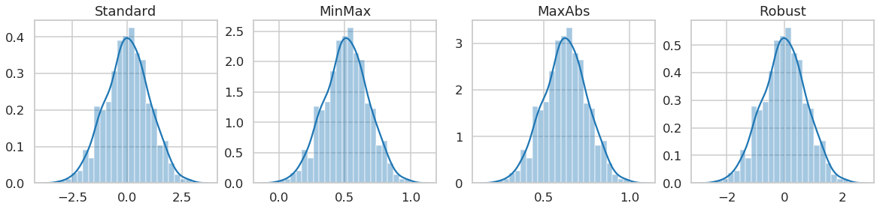

# Robust Feature Selection 


## Feature scaling

Use `MaxAbsScaler/MinMaxScaler/RobustScaler/StandardScaler` for feature scaling.

```python
random_state = np.random.RandomState(1289237)
x = random_state.normal(10, 2, size=1000)
from sklearn.preprocessing import StandardScaler, MinMaxScaler, MaxAbsScaler, RobustScaler
scalers = {
    'Standard': StandardScaler(),
    'MinMax': MinMaxScaler(),
    'MaxAbs': MaxAbsScaler(),
    'Robust': RobustScaler()
}
scalernames = ['Standard','MinMax','MaxAbs','Robust']
fig, axes = plt.subplots(1,4, figsize=(20, 4))
for i in range(4):
    x_scaled = scalers[scalernames[i]].fit_transform(x.reshape(-1,1)).ravel()
    sns.distplot(x_scaled, ax=axes[i])
    axes[i].set_title(scalernames[i])
```




## Robust Feature Selection Pipeline

- Normalize domain coverage by total coverage of all domains (CPM), Normalize Top20 and others separately. 
- Scale each feature (log CPM) independently (using z-scores, min-max, robust normalization)
- Run a classifier (random forest, logistic regression, linear SVM) to select features based on feature importance. Optimize hyper-parameters by 3-fold cross-validation.
- **Optionally**, use a recursive feature elimination(RFE).
- Do resampling runs to select robust features:
    - shuffle and split dataset and repeat feature selection for 100 times(shuffle split)
    - Or randomly test 1 sample in each run (leave one out).
- Select features that are recurrently selected across resampling runs (>50%)
- Refit the classifier on selected features

