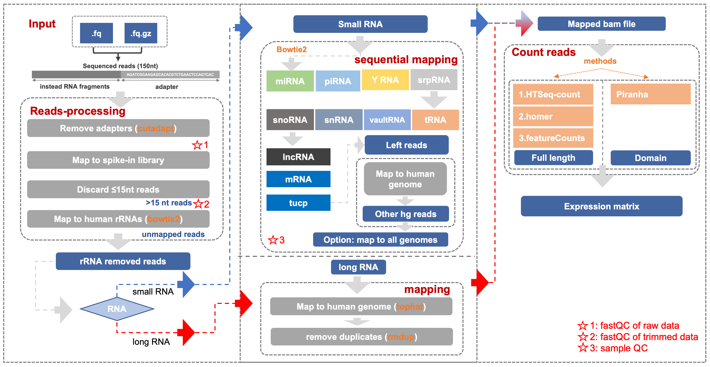

# Reads Processing and Mapping   

**Overall flow chart**



## Data Structure

```text
~/proj_exRNA/
|-- data
    |-- RNA_index      #Different types of indexes to which reads map
    |-- hg38_index     #The index to which reads map
    |-- raw_data
|-- stat               #The file where the results of statistical analysis store
|-- output             #You can sort the outputs as you like. The following is the author's setting according to the processes
eg:
    |-- 01.trim        
        |-- QC1        
        |-- trim       
        |-- QC2        
    |-- 02.mapping     
        |-- no_rRNA
            |-- fastq    #Save *.no_rRNA.fq
            |-- sam      #Save *.<rRNA>.sam
            |-- rsem_bam #Convert .sam to .bam file      
        |-- no_miRNA   
        |-- ...
        |-- no_hg38other
            |-- fastq    
            |-- sam      
            |-- bam      #The tools used for converting .sam to .bam file are different, so the folder is renamed to bam by rsem_bam
    |-- 03.tags        #The folder where the files of expression matrices constructed by homer , this tutorial does not need to establish this folder
        |-- Sample_N1
            |-- miRNA
            |-- ...
        |-- ...
    |-- 04.counts      #The folder where expression matrices of different types of RNA store
    |-- 05.matrix      #The folder where merged expression matrices store
    |-- tmp            #The folder where temporary files store
```

**Inputs**

| **File format** | **Information contained in file** | **File description** |
| :--- | :--- | :--- |
| fastq | **reads** | five samples, GEO link: GSE71008 |

**Outputs**

| **File format** | **Information contained in file** |
| :--- | :--- |
| sam/bam | mapped reads to different kinds of indexes |
| tsv format | stats of RNA ratio and length |

## Running Steps

### Capture Data

retrieve genomic data `hg38`, genomic annotation data `/gtf`, index files `/RNA_index` and raw data `(fastq files)` from previous step to your own account.

| data | path |
| :--- | :--- |
| `hg38` | `sequence/GRCh38.p10.genome.fa` |
| `gtf` | `gtf/` |
| `RNA index` | `RNA_index/` |
| `raw data` | `prepare yourself` |

It is recommended to use the `ln` or `cp` command.

### QC-Trim-QC

There are two main purposes for this step, one is to control the quality of the data, and the other is to subtract the adapter sequence.

* **Step one - QC of raw data**

**Input:**

| data type | path |
| :--- | :--- |
| `raw data` | `prepare yourself` |

**Software/Parameters:**

`fastqc`

| `options` | function |
| :--- | :--- |
| `-q --quiet` | Supress all progress messages on stdout and only report errors. |
| `-o --outdir` | Create all output files in the specified output directory. |
| `-h --help` | detailed introduction of options |

**Output:**

QC files

* **step two - cut adaptor & trim long read**

**Input:**

| data type | **path** |
| :--- | :--- |
| `raw data` | `prepare yourself` |

**Software/Parameters:**

`cutadapt`: cutadapt removes adapter sequences from high-throughput sequencing reads.

Usage: `cutadapt -a ADAPTER [options] [-o output.fastq] input.fastq`

| `options with Parameter Setting` | function |
| :--- | :--- |
| `-u -100` | remove last 100nt so that the first 50nt is kept |
| `-q 30,30` | read quality need to be above 30 |
| `-m 16` | reads less than 15nt are removed |
| `-a AGATCGGAAGAGCACACGTCTGAACTCCAGTCAC` | cut adapt |
| `--trim-n` | trim N's on ends of reads. |

**Output:**

`*.cutadapt.fastq`

* **step three - QC after Trim**

Input file is data after trimming, similar to step one


### Clean rRNA reads**

You can map `.fastq` files to rRNA index using Bowtie2 to get **`.fastq`** files **without rRNA reads** and **`.sam`** files as outputs of **mapping to rRNA index**.

**Input:**

`*.cutadapt.fastq` as the output of the operation 2.2.2

**Software/Parameters:**

Use Bowtie2, and clean rRNA reads, to get `.fastq` files without rRNA reads and `.sam` files as output of mapping to rRNA index.

```text
bowtie2 -p 4 [options] -x <bt2-idx> --un <address of unmapped reads> $input_file [-S <sam>]
```

| `options with Parameter Setting` | function |
| :--- | :--- |
| `--sensitive-local(default)` | allow no mismatch, etc |
| `--norc` | do not align reverse-complement version of read |
| `--no-unal` | suppress SAM records for unaligned reads |
| `--un` `<path to unmapped reads>` | store unmapped reads |
| `-x` `<path to index>/rRNA` | indexed genome/transcriptome |
| `-S` `<path to output file>` | output file foramt as sam |

For those `.sam` files as outputs of mapping to the rRNA index, you can use `rsem-tbam2gbam` command to convert them to `.bam` files.

```text
rsem-tbam2gbam <bt2-idx> <sam> genome_bam_output
```

**Output:**

`.fastq` file `*.rRNA.unAligned.fastq` without rRNA reads, located in folder `.../fastq` , see Data Structure

`*.<rRNA>.sam` files as outputs of mapping to rRNA index, located in folder `.../sam`

with `*.<rRNA>.rsem.clean.bam` files，located in folder `.../rsem_bam`

### Sequential Mapping

The purpose of this step is to acquire the `.sam` files by comparing reads to the indexes of various RNA types (such as miRNA, piRNA, Y RNA and srp RNA, etc.). The mapping process is similar to the process of cleaning rRNA reads.

However, the index in operation 2.2.3 is rRNA, just 1) ** replace indexes with other types of indexes**, 2) **treat `*.<some type of RNA>.unAligned.fastq` which is outputs of the previous step as inputs of the next step**., then repeat 1) 2) until all indexes are used so that we finish sequential mapping.


**Input:**

`*.<some type of RNA>.unAligned.fastq` \(`*.rRNA.unAligned.fastq` in first step\)

**Software/Parameters:**

Similar to 2.2.3, just modify the index and input:

```text
bowtie2 -p 4 [options] -x <bt2-idx> --un <address of unmapped reads> $input_file [-S <sam>]
```

| `Parameter Setting` |
| :--- |
| `-x` `<path to index>/<some type of RNA>` |
| `*.<RNA --un by the previous step>.fq`   as `$input_file` |
| `-un<path to output>/*.<some type of RNA>.unAligned.fastq` |
| `-S` `<path to .sam file>/<some type of RNA>.sam` |

For those `.sam` files as outputs of mapping to the rRNA index, you can use `rsem-tbam2gbam` command to convert them to `.bam` files.

For `.sam` files as outputs of mapping to the index hg38, you can use `samtools view` function to convert them to `.bam` files. You can type `samtools view -h` to see how to convert.


**Output:**

`.fastq` files `*.<some type of RNA>.unAligned.fastq` without some type of RNA reads \(file naming is different from one in the process of cleaning rRNA reads, and you can rename them as you like\)

`*.<some type of RNA>.sam` files as outputs of mapping to some type of RNA index

with `*.<some type of RNA>.rsem.clean.bam` files

**Attention:**

* The reads are sequentially mapped to various types of RNA indexes, and the recommended order is `miRNA, piRNA, Y_RNA, srpRNA, tRNA, snRNA, snoRNA, lncRNA, mRNA, tucp`, and finally `hg38other`

* The last step of the map is very special, 1) index is no longer RNA\_index, but hg38 which is not in the folder `RNA_index`. Pay attention to it. 2) The tool used for converting sam to bam is also different, and the output file should no longer be theoretically `* .hg38other.rsem.clean.bam` but `*.hg38other.bam`, but files' name will affect the simplicity of the subsequent code which need to pay attention to.

### length & ratio

For reads mapping to different types of RNA indexes, we can **count the length** to observe the length distribution of different RNA types; we can also **count the proportion of reads** of different RNA types as a reference for sample QC.

#### length

Here is the statistical analysis of length, and the script is located at `/BioII/chenxupeng/student/bin/length.sh`

The outputs containing the length information obtained by running the script can be simplified using Python.

```text
import pandas as pd
def get_length_table(samplename):
    '''
    sample name: Sample_N14
    '''
    pd.read_table('/BioII/chenxupeng/student/data/other_annotations/length/'+samplename+'.lengthN.stat.tsv')
    df = pd.read_table('/BioII/chenxupeng/student/data/other_annotations/length/'+samplename+'.lengthN.stat.tsv')
    df = df.pivot(index='type',columns='len',values='num')
    df = df.fillna(0)
    return df
get_length_table('Sample_N14')
```

**ratio**

Here is the statistical analysis of ratio, and the script is located at `/BioII/chenxupeng/student/bin/ratio.sh`

The outputs containing the ratio information obtained by running the script can be simplified using Python.

```text
def get_counts(samplename):
    '''
    samplename: Sample_N14
    '''
    df = pd.read_table('/BioII/chenxupeng/student/data/other_annotations/counts/'+samplename+'.readsN.stat.tsv',
              names=['sample','method','type','counts']).pivot(index='type',columns='sample',values='counts')
    return df
get_counts('Sample_N14')
```
