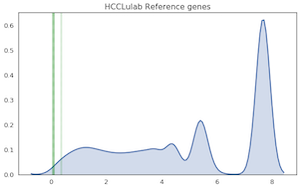
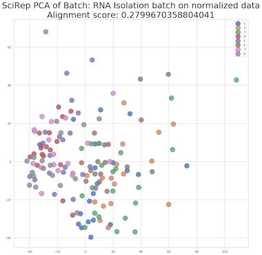

# Matrix Processing   

```
-s imputation normalization batch_removal
--normmethod SCnorm,TMM,RLE,CPM,CPM_top,CPM_rm,CPM_refer
--batchmetod RUV,Combat
--batchindex 1,2,3

bin/matrix-process.R -s batch_removal \
-i output/scirep/count_matrix/transcript.txt \
--imputemethod scimpute_count \
--imputeout output/scirep/matrix_processing/imputation/ \
--filtercount 5 \
--filtersample 10 \
--imputecluster 5 \
-p 4 \
--normalizeout output/scirep/matrix_processing/normalization/ \
--normmethod RLE \
--normtopk 20 \
--removetype miRNA,piRNA \
--cvthreshold 0.5 \
--refergenefile data/matrix_processing/refer_gene_id.txt \
-c data/labels/scirep_classes.txt \
-b data/other_annotations/scirep_batch.txt \
--batchremoveout output/scirep/matrix_processing/batch_removal/ \
--batchmethod RUV \
--batchindex 1
```

## Imputation
scImpute


## Normalization
Normalization is performed for the systematic error of each sample (such as the sequencing depth).

** Different Normalization Methods**

* CPM\(counts per million\)
* Use candidate reference gene. For example: `'MIR1228', 'MIR16-1', 'MIR16-2', 'MIR21', 'MIR23A', 'MIR23B', 'MIR23C', 'MIR451A', 'MIR15A', 'MIR15B'`
* remove piRNA and miRNA and use CPM\(counts per million\)
* Use top20 as scale factor
* use packages:
    * SCNorm
    * RLE
    * TMM


### Select Reference Gene

A density plot or a violin plot is used to analyze the coefficient of variation of different reference genes, and select stable miRNAs as an internal references with a small coefficient of variation. It can be seen that the variation coefficient of MIR1228 and MIR15B is not stable enough, and should not be used as an internal reference.

 


- [ ]to do: add more details

### Criteria to use top20

We recommend to use top20 as scale factor if they account for more than 50% of total counts.


## Batch Removal

### Visualize Batch Effect


Batch Removal methods:

* RUVs
* Combat

## Use alignment score to Quantify Clustering effect.

PCA and t-SNE can visualize the aggregation degree of the sample, but it cannot be quantified to compare different methods. We provide the following two functions _alignment\_socre_ & _knn\_score_ to quantify the binary classification and multi-class classification respectively. The closer the value is to 1, the more aggregated samples are.

```python
def alignment_score(X, y, K=10):
    N = X.shape[0]
    nn = NearestNeighbors(K)
    nn.fit(X)
    distances, indices = nn.kneighbors(X, K + 1)
    neighbor_classes = np.take(y, indices[:, 1:])
    same_class_fractions = np.sum(neighbor_classes == y[:, np.newaxis], axis=1)
    score = 1.0 - (np.mean(same_class_fractions) - K/N)/(K - K/N)
    print (same_class_fractions.shape,np.mean(same_class_fractions),K/N,neighbor_classes)
    return score
def knn_score(X, y, K=10):
    N = X.shape[0]
    assert K < N
    nn = NearestNeighbors(K)
    nn.fit(X)

    distances, indices = nn.kneighbors(X, K + 1)
    neighbor_classes = np.take(y, indices[:, 1:])
    same_class_fractions = np.sum(neighbor_classes == y[:, np.newaxis], axis=1)

    classes, counts = np.unique(y, return_counts=True)
    classes = np.argmax(y.reshape((-1, 1)) == classes.reshape((1, -1)), axis=1)
    counts = np.take(counts, classes)
    mean_r = K/(N - 1)*counts
    max_r = np.minimum(K, counts)
    #print (same_class_fractions.shape,mean_r.shape,max_r.shape)
    #scores = (np.mean(same_class_fractions) - mean_r)/(max_r - mean_r)
    scores = (same_class_fractions - mean_r)/(max_r - mean_r)
    #print(scores)
    return scores.mean()
```



### Matrix processing function
- [ ]to do: add details

