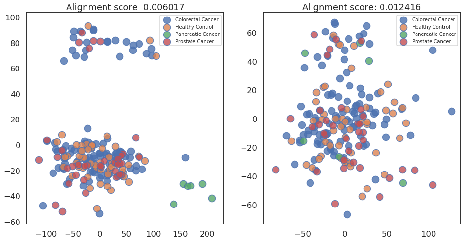
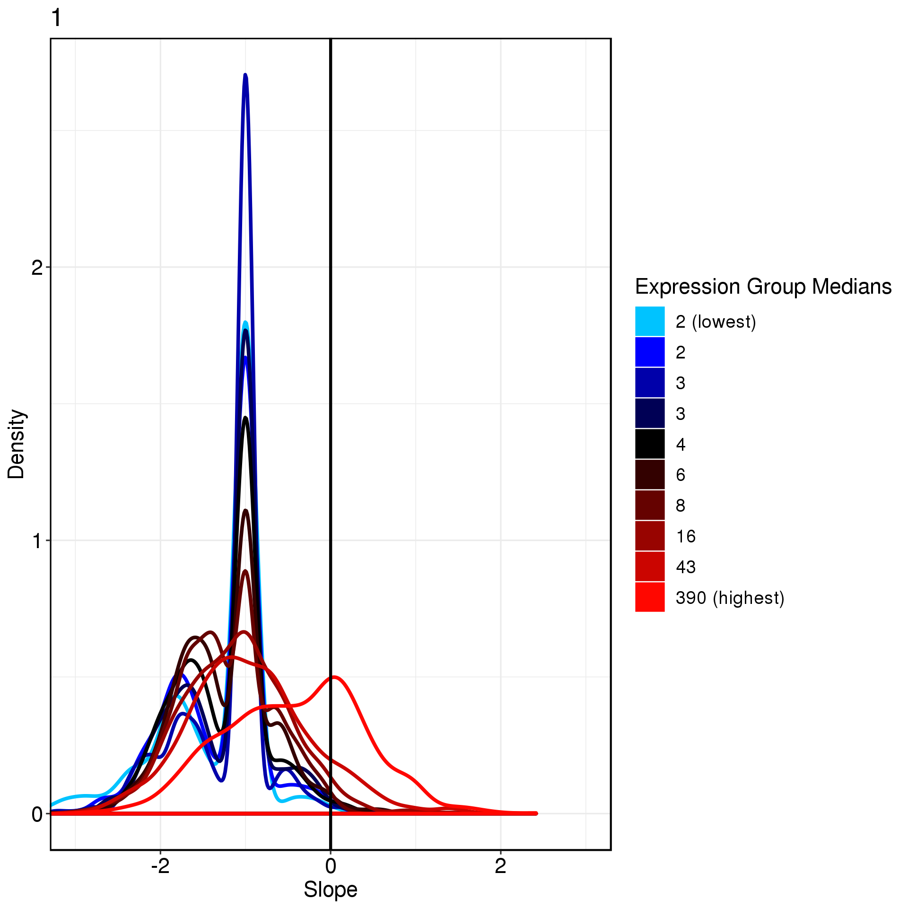
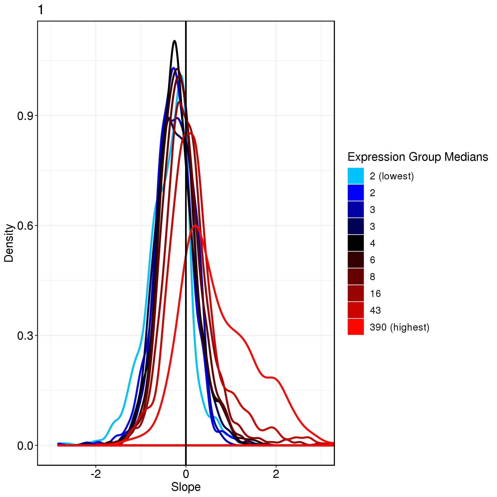
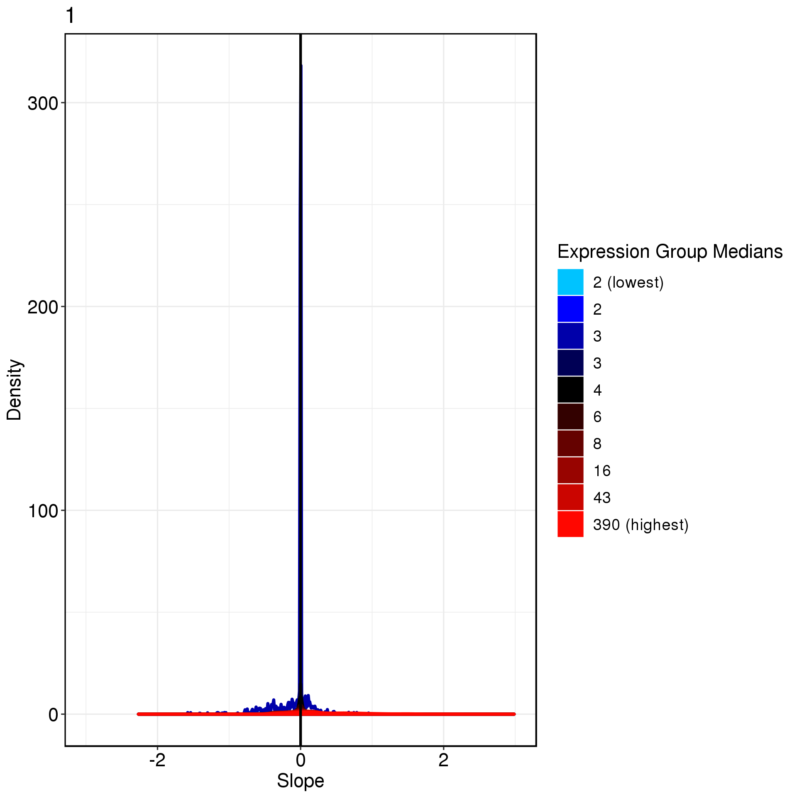

# Matrix Processing   


```
usage: bin/matrix-process.R [-h] -s STEP -i INPUT -c CLASS -b BATCH
                            --filterout FILTEROUT --imputeout IMPUTEOUT
                            --normalizeout NORMALIZEOUT --batchremoveout
                            BATCHREMOVEOUT [--filtercount NUMBER]
                            [--filtersample NUMBER] [--imputemethod STRING]
                            [--imputecluster NUMBER] [--imputenum NUMBER]
                            [--imputecutoff NUMBER] [--imputealpha NUMBER]
                            [--normmethod STRING] [--normtopk NUMBER]
                            [--cvthreshold NUMBER] [--removetype STRING]
                            [--refergenefile STRING] [--batchmethod STRING]
                            [--batchindex INT] [-p NUMBER]

optional arguments:
  -h, --help            show this help message and exit
  -s STEP, --step STEP  which step to run
  -i INPUT, --input INPUT
                        input expression matrix file
  -c CLASS, --class CLASS
                        input class info file
  -b BATCH, --batch BATCH
                        input batch info file
  --filterout FILTEROUT
                        output filter path
  --imputeout IMPUTEOUT
                        output imputation path
  --normalizeout NORMALIZEOUT
                        output normalization file
  --batchremoveout BATCHREMOVEOUT
                        output batchremoved file
  --filtercount NUMBER  filter by counts of a gene [default = 5]
  --filtersample NUMBER
                        filter by counts of sample above certain counts of a
                        gene [default = 10]
  --imputemethod STRING
                        the imputation algorithm to use [default =
                        scimpute_count]
  --imputecluster NUMBER
                        cluster number in scImpute [default = 5]
  --imputenum NUMBER    number in viper [default = 5000]
  --imputecutoff NUMBER
                        cutoff in viper [default = 0.5]
  --imputealpha NUMBER  alpha in viper [default = 0.1]
  --normmethod STRING   the normalization algorithm to use [default = SCNorm]
  --normtopk NUMBER     top K feature as scale factor [default = 20]
  --cvthreshold NUMBER  coefficient variance threshold of reference gene,
                        filter ref gene with CV bigger than [default = 0.5]
  --removetype STRING   remove some time of RNA for normalization scale factor
                        calculation [default = miRNA,piRNA]
  --refergenefile STRING
                        reference gene file path [default = None]
  --batchmethod STRING  the batch removal algorithm to use [default = RUV]
  --batchindex INT      batch index to select which batch to use [default = 1]
  -p NUMBER, --processors NUMBER
                        Number of processors to use. This option is useful on
                        multicore *nix or Mac machine only, when performing
                        multiple runs (nrun > 1) [default = 1]
```

- **Some parameters:**

```
-s filter imputation normalization batch_removal
--imputemethod scimpute_count,viper_count,null
--normmethod SCnorm,TMM,RLE,CPM,CPM_top,CPM_rm,CPM_refer,null
--batchmetod RUV,Combat,null
--batchindex 1
```

- **Example:**

```
bin/matrix-process.R -s imputation \
-i output/lulab_hcc/count_matrix/domains_combined.txt \
--filterout  output/lulab_hcc/matrix_processing/ \
--imputemethod viper_count \
--imputeout output/lulab_hcc/matrix_processing/ \
--filtercount 5 \
--filtersample 10 \
--imputecluster 5 \
--imputenum 5000 \
--imputecutoff 0.1 \
--imputealpha 0.5 \
-p 4 \
--normalizeout output/lulab_hcc/matrix_processing/ \
--normmethod RLE \
--normtopk 20 \
--removetype miRNA,piRNA \
--cvthreshold 0.5 \
--refergenefile data/matrix_processing/refer_gene_id.txt \
-c data/lulab_hcc/sample_classes.txt \
-b data/lulab_hcc/batch_info.txt \
--batchremoveout output/scirep/matrix_processing/ \
--batchmethod RUV \
--batchindex 1
```


## Filter
filter lowly expressed reads

## Imputation
scImpute


## Normalization
Normalization is performed for the systematic error of each sample (such as the sequencing depth).

** Different Normalization Methods**

* CPM\(counts per million\)
* Use candidate reference gene. For example: `'MIR1228', 'MIR16-1', 'MIR16-2', 'MIR21', 'MIR23A', 'MIR23B', 'MIR23C', 'MIR451A', 'MIR15A', 'MIR15B'`
* remove piRNA and miRNA and use CPM\(counts per million\)
* Remove top k and scale others (then add top k back)
* use packages:
    * SCNorm
    * RLE
    * TMM


### Select Reference Gene

A density plot or a violin plot is used to analyze the coefficient of variation of different reference genes, and select stable miRNAs as an internal references with a small coefficient of variation. It can be seen that the variation coefficient of MIR1228 and MIR15B is not stable enough, and should not be used as an internal reference.

- Density plot of CV

 

- Boxplot of expression value (log)


### Criteria to use top20

We recommend to remove top20 and use left genes sum as scale factor if they account for more than 50% of total counts.

- cumulative ratio


- highest expressed gene


## Batch Removal

### Visualize Batch Effect
- visualize batch by counts
- 


- visualize batch by specific RNA counts
- 


- [ ] to do select batch factor plot


### Batch Removal methods

* RUVs
* Combat


## visualize processed result
### PCA visualization
**Use alignment score to Quantify Clustering effect.**

PCA and t-SNE can visualize the aggregation degree of the sample, but it cannot be quantified to compare different methods. We provide the following two functions _alignment\_socre_ & _knn\_score_ to quantify the binary classification and multi-class classification respectively. The closer the value is to 1, the more aggregated samples are.


- PCA visualization of original matrix and processed matrix





### expression vs count depth

- scImpute


- CPM


- CPM, remove mi and piRNA


- CPM remove top


- CPM use reference gene


- RLE


-TMM


-SCnorm



### Relative Log Expression box plot


