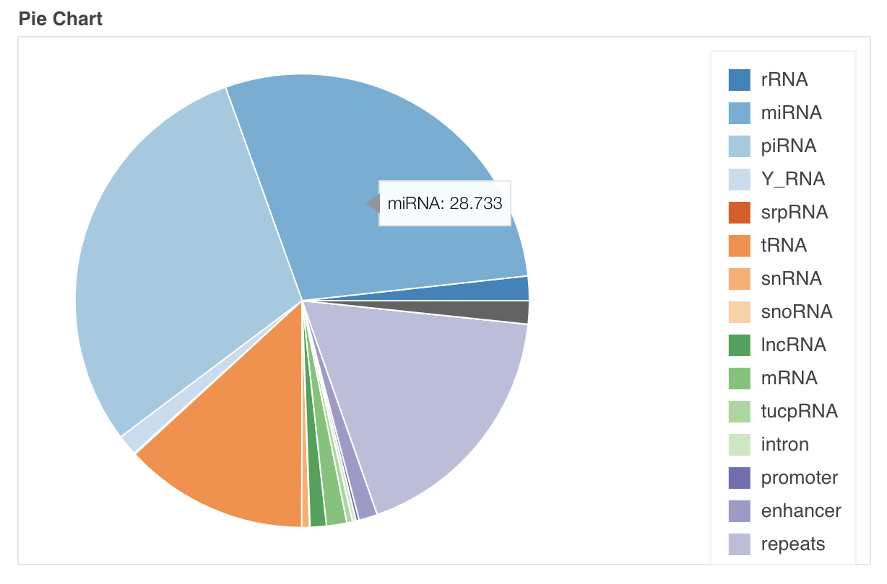
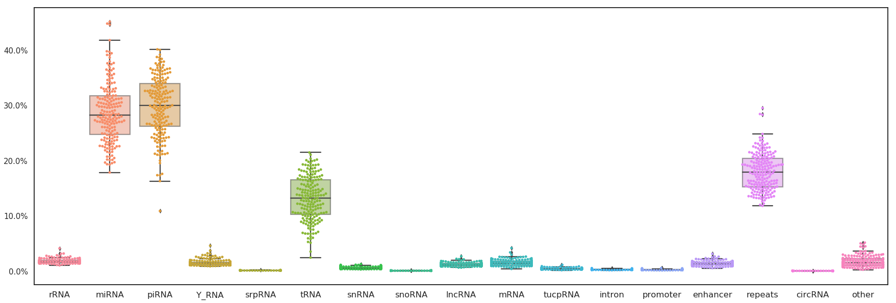
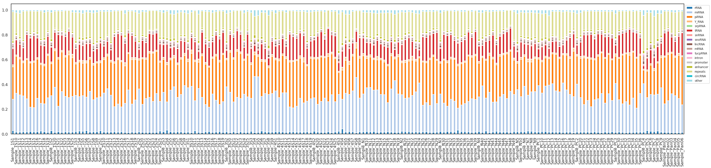
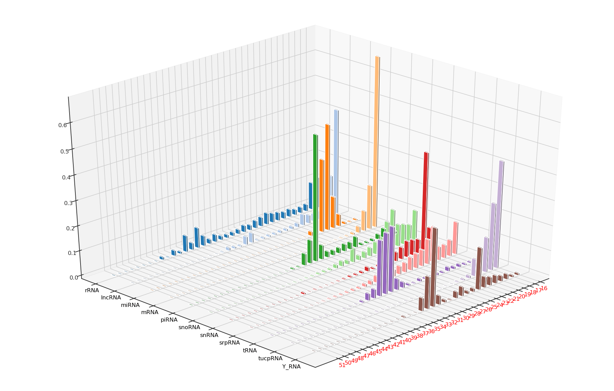
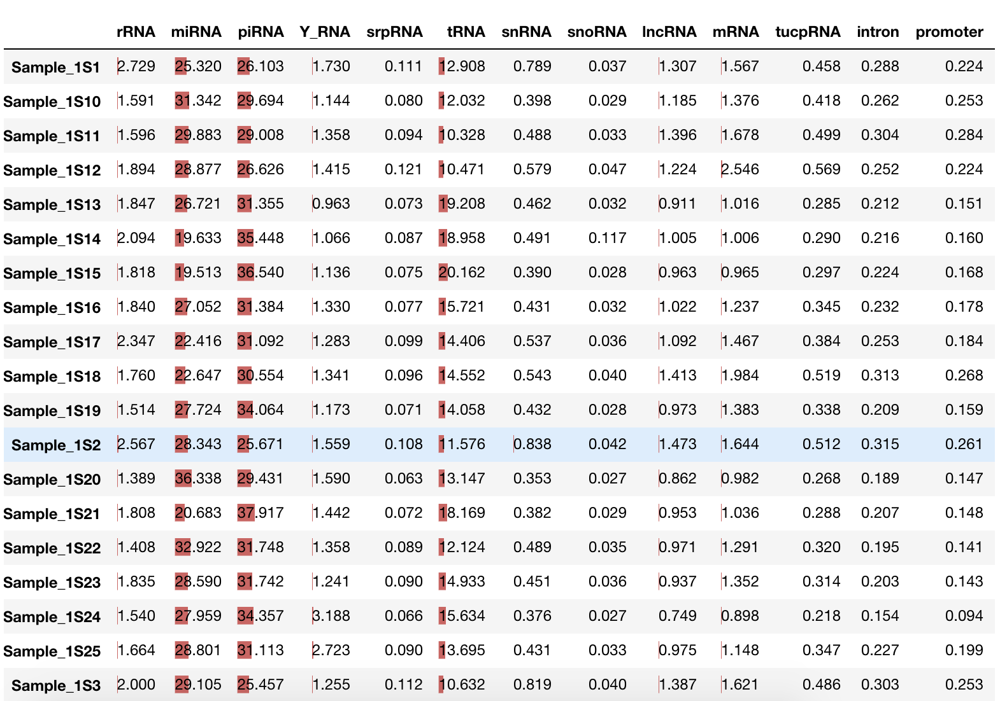

# Statistical analysis and Quality Control

## Basic Analysis    

###  Counts, Ratio and Length of different RNA type

- Ratio Pie Plot 

**Count the proportion of different RNA type and show them in a pie chart**

- Ratio Box Plot 

**Count the proportion of different RNA type and show them in a boxplot**

**Count the proportion of different RNA type and show them by sample**

- 3D bar plot 

- Stack Bar ratio plot 

- Stack Bar count plot 

- Length Line Plot

**Counting the length distribution of mapped reads of different RNA types**

- Length 3D Bar Plot

**Counts of specific RNA types in different samples**

- Bar plot of ratio

- Bar plot of count

### Sample QC   

We have developed a set of criteria for quality control of samples based on the ratio of different RNA type reads:

| **Check point** | **Threshold** | **Notes** |
| :--- | :--- | :--- |
| Raw reads quality | reads quality &gt;28 \(median lines in green area\) | Check fastqc results\(\*.html\) |
| Clean reads number | **&gt; 10 million** | Adaptors and too-short sequences removed reads |
| rRNAs% | **&lt; 10%** | Reads mapped to rRNAs \(all following % are divided by the **total number of clean reads**\) |
| HG% | &gt; 60% \(optional\) | Reads mapped to Human Genome **except rRNAs** |
| Transcriptome% | **&gt; 50%** | Reads mapped to Human **Transcriptome** \(including rRNA, miRNA, piRNA, Y RNA, srpRNA, snRNA, snoRNA, tRNA, mRNA exons, lncRNA exons, TUCP exons\) |
| Y RNA% | **10%~65%** | Reads mapped to Y RNA |
| miRNA% | **10%~65% \(**up to 80% for exoRNAs**\)** | Reads mapped to miRNA |

- FastQC

- Sample QC

- [ ] to do: sample QC

